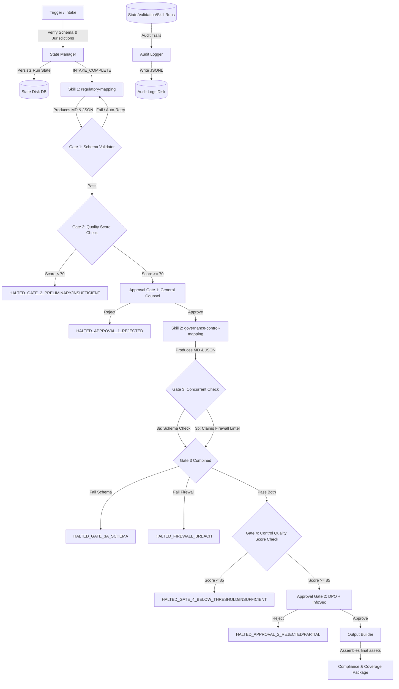

# Regulatory Watch Agent Runtime v0.1 — Architecture & Contracts

This document specifies the design, interface contracts, file layout, and execution flows for the **Regulatory Watch Agent Runtime v0.1**.

## 1. Runtime Architecture

The Regulatory Watch Agent Runtime is a structured, state-driven, single-agent execution environment designed to orchestrate the compliance workflow. It manages inputs, validates execution, runs quality gates, logs audit events, tracks approval states, and builds final packages.



---

## 2. Directory Structure

The runtime files are structured inside `agents/regulatory-watch-agent/runtime/`:

```
agents/regulatory-watch-agent/runtime/
├── README.md               # This architecture and contract document
├── config.yaml             # Runtime configurations, schema paths, mock mappings
├── audit_logger.py         # Structured audit logging class
├── state_manager.py        # Persistent state manager and transition engine
├── schema_validator.py     # JSON Schema validation wrapper with fallback
├── output_builder.py       # Package assembler and partial-release packager
└── orchestrator.py         # Main execution engine coordinating skills & gates
```

---

## 3. Interface Contracts

Each module in the runtime follows a strict object-oriented interface contract:

### 3.1 `audit_logger.py`
Provides structured audit tracing for the execution pipeline.

```python
class AuditLogger:
    def __init__(self, log_dir: str, traceability_id: str):
        """Initializes the audit logger for a specific run."""
        pass
        
    def log(self, step: str, status: str, message: str, details: dict = None) -> None:
        """Logs a single audit event with timestamp (ISO 8601 UTC)."""
        pass

    def get_logs(self) -> list:
        """Reads and returns all log entries for this run."""
        pass
```

### 3.2 `state_manager.py`
Enforces the state-machine rules, prevents forbidden transitions, and persists state to disk.

```python
class StateManager:
    def __init__(self, state_dir: str, traceability_id: str):
        """Initializes state manager with persistent filepath."""
        pass

    def initialize_run(self, inputs: dict) -> dict:
        """Creates the initial run state and commits to disk."""
        pass

    def transition_to(self, to_state: str, trigger: str, actor: str = None, notes: str = None) -> dict:
        """
        Transitions to a new state if valid.
        Raises ValueError if transition is forbidden or invalid.
        """
        pass

    def update_intermediate_data(self, key: str, value: any) -> None:
        """Updates intermediate data blocks (e.g., skill output JSON/MD)."""
        pass

    def get_state(self) -> dict:
        """Returns the current raw state dictionary."""
        pass

    @staticmethod
    def load_run(state_dir: str, traceability_id: str) -> dict:
        """Loads a run state from file."""
        pass
```

### 3.3 `schema_validator.py`
Validates skill payloads against schemas using `jsonschema` (or custom fallback).

```python
class SchemaValidator:
    def __init__(self, schemas_dir: str):
        """Initializes the validator with the schemas directory path."""
        pass

    def validate(self, payload: dict, schema_name: str) -> list:
        """
        Validates payload against a specific JSON schema.
        Returns a list of error strings. Empty list indicates success.
        """
        pass
```

### 3.4 `output_builder.py`
Assembles final outputs or partial releases.

```python
class OutputBuilder:
    def __init__(self, output_dir: str, traceability_id: str):
        """Initializes the builder with target directories."""
        pass

    def assemble_final_package(self, run_state: dict, audit_logs: list) -> str:
        """
        Bundles MDs, JSONs, logs, and coverage reports.
        Returns the path to the final assembled package zip/folder.
        """
        pass

    def assemble_partial_package(self, run_state: dict, audit_logs: list) -> str:
        """
        Packages Skill 1 outputs post-Approval-1 if run subsequently halted.
        Returns the path to the partial package.
        """
        pass
```

### 3.5 `orchestrator.py`
The main orchestrator execution interface.

```python
class Orchestrator:
    def __init__(self, config_path: str):
        """Loads runtime configurations and initializes subcomponents."""
        pass

    def start_run(self, trigger_type: str, inputs: dict) -> str:
        """Intakes trigger payload, validates inputs, starts the run state, and triggers Skill 1."""
        pass

    def submit_approval_1(self, traceability_id: str, action: str, actor: str, notes: str = None) -> None:
        """Submits General Counsel decision for Approval Gate 1."""
        pass

    def submit_approval_2(self, traceability_id: str, action: str, actor: str, notes: str = None) -> None:
        """Submits DPO / InfoSec decisions for Approval Gate 2."""
        pass

    def execute_mode_b(self, regulatory_change_alert: dict) -> list:
        """Runs Watch Mode (Mode B), querying historical runs, queuing reassessments."""
        pass
```

---

## 4. Execution Flow and Quality Gates

### Step-by-Step Flow:
1. **Intake:** Orchestrator validates inputs against the trigger type rules (jurisdictions must be in `[EU, UK, India]`). Creates trace ID `TR-RW-{YYYY}-{NNNN}`.
2. **Skill 1 Execution:** Simulates `regulatory-mapping` execution. Outputs markdown scoping matrix and JSON payload.
3. **Gate 1 (Schema Validator):** Schema checks the JSON payload.
   - *Failure:* Auto-retries once. If it fails again, transitions to `HALTED_GATE_1_SCHEMA`.
4. **Gate 2 (Quality Score Check):** Evaluates markdown structure and score.
   - *Score < 55:* Transitions to `HALTED_GATE_2_INSUFFICIENT`.
   - *Score 55–69:* Transitions to `HALTED_GATE_2_PRELIMINARY`.
   - *Score >= 70:* Transitions to `GATE_2_PASSED` $\rightarrow$ `APPROVAL_1_PENDING`.
5. **Approval Gate 1:** General Counsel signs off.
   - *Action Reject:* Transitions to `HALTED_APPROVAL_1_REJECTED`.
   - *Action Approve:* Transitions to `APPROVAL_1_APPROVED` $\rightarrow$ `SKILL_2_RUNNING`.
6. **Skill 2 Execution:** Simulates `governance-control-mapping` using the output of Skill 1.
7. **Gate 3 (Concurrent Check):**
   - **Gate 3a (Schema):** Validates JSON output of Skill 2.
   - **Gate 3b (Claims Firewall):** Lints the markdown file against `canonical-product-model.md` using `claims_linter.py`.
   - *Firewall Fail:* Transitions to `HALTED_FIREWALL_BREACH` (precedence over schema).
   - *Schema Fail, Firewall Pass:* Transitions to `HALTED_GATE_3A_SCHEMA`.
   - *Both Pass:* Transitions to `GATE_3_PASSED`.
8. **Gate 4 (Control Quality Score Check):**
   - *Score < 70:* Transitions to `HALTED_GATE_4_INSUFFICIENT`.
   - *Score 70–84:* Transitions to `HALTED_GATE_4_BELOW_THRESHOLD`.
   - *Score >= 85:* Transitions to `GATE_4_PASSED` $\rightarrow$ `APPROVAL_2_PENDING`.
9. **Approval Gate 2:** DPO and InfoSec joint review.
   - *If 'Approve with modifications':* Incorporates changes, re-runs Gate 3a, Gate 3b, and Gate 4, then proceeds.
   - *If Reject:* Transitions to `HALTED_APPROVAL_2_REJECTED`.
   - *If Partial (one approves, one rejects):* Transitions to `HALTED_APPROVAL_2_PARTIAL`.
   - *If Approved:* Transitions to `APPROVAL_2_APPROVED` $\rightarrow$ `COMPLETE`.
10. **Output Package:** Output Builder compiles final assets.
