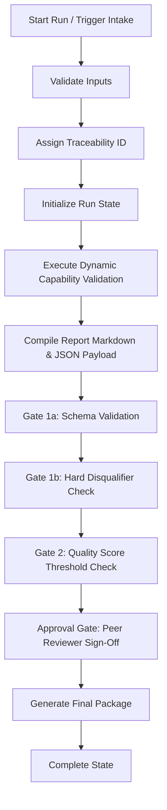

# Capability Validation Agent Runtime v0.1 — Architecture Report

**Document type:** Architecture Specification  
**Agent:** [Capability Validation Agent](file:///Users/ajayrajsingh/Documents/governance-os/agents/capability_validation_agent/AGENT.md)  
**Readiness Level:** L4 (Certified Production Ready)  
**Skill:** [ethana-capability-validation](file:///Users/ajayrajsingh/Documents/governance-os/skills/ethana-capability-validation/SKILL.md)  
**Status:** Implemented and Verified  

---

## 1. Executive Summary

The **Capability Validation Runtime v0.1** is the second production runtime built on the Governance OS agent runtime framework. It mirrors the design patterns proven in the Regulatory Watch Agent runtime but is dedicated to verifying client-facing capability claims against the canonical product truth.

The runtime guarantees that no unreleased (In Build or Aspirational) Ethana features are presented as "Production" in customer proposals, marketing content, or technical documentation. It dynamically adjudicates claims, enforces a multi-gate validation pipeline, and integrates a human-in-the-loop peer review step before generating an immutable release package.

---

## 2. Component Reuse & Framework Alignment

To ensure consistency and high reliability, the Capability Validation Runtime reuses the following core components from the Governance OS framework without modifications:

1.  **State Manager ([state_manager.py](file:///Users/ajayrajsingh/Documents/governance-os/agents/capability_validation_agent/runtime/state_manager.py)):** Coordinates state transitions, tracks run logs, handles persistence of intermediate data, and records human approval decisions.
2.  **Audit Logger ([audit_logger.py](file:///Users/ajayrajsingh/Documents/governance-os/agents/capability_validation_agent/runtime/audit_logger.py)):** Generates structured, append-only JSONL files verifying the traceability and integrity of every step.
3.  **Schema Validator ([schema_validator.py](file:///Users/ajayrajsingh/Documents/governance-os/agents/capability_validation_agent/runtime/schema_validator.py)):** Enforces type-safety and structural compliance of intermediate payloads against JSON Schema definitions.
4.  **Claims Firewall Concept:** Implemented as a combination of Gate 1 validations and the **7 Hard Disqualifiers (HQ1–HQ7)**. Rather than running the raw markdown claims linter directly on validation reports (which would cause false positives when discussing prohibited features), the firewall is integrated as structured constraints evaluated directly on the validated data model.

---

## 3. Runtime Lifecycle & Execution Flow

The Capability Validation pipeline operates through the following steps:

### 3.1 Flow Breakdown

1.  **Intake & Traceability:** The runtime accepts triggers (e.g. `new_capability_validation_request`). It automatically validates fields and assigns a unique traceability ID matching the format `TR-CV-{YYYY}-{NNNN}`.
2.  **Dynamic Skill Execution:** The [SkillExecutor](file:///Users/ajayrajsingh/Documents/governance-os/agents/capability_validation_agent/runtime/skill_executor.py) parses [canonical-product-model.md](file:///Users/ajayrajsingh/Documents/governance-os/knowledge/ethana/canonical-product-model.md) to extract capabilities and their statuses. It evaluates the requested capability name and proposed claim, matching them against the canonical entry and corroborating secondary sources (architecture specs, use cases).
3.  **Adjudication & Verification Gates:**
    *   **Gate 1a (Schema Verification):** Validates the output JSON against [capability_validation_output.json](file:///Users/ajayrajsingh/Documents/governance-os/agents/capability_validation_agent/runtime/contracts/capability_validation_output.json).
    *   **Gate 1b (Firewall Disqualifiers):** Evaluates `hard_disqualifiers_triggered` (HQ1–HQ7). If any disqualifiers are triggered (e.g. CPL-5 in allowed claims, Aspirational capability allowed, canonical model not consulted first, etc.), the pipeline transitions to `HALTED_FIREWALL_BREACH`.
    *   **Gate 2 (Quality Score):** Computes a compliance quality score based on the Evidence Confidence Score (ECS) and audit completeness. The score must meet the configured threshold of `90/100` to proceed. If it fails, the run transitions to `HALTED_GATE_2_INSUFFICIENT`.
4.  **Peer Review Gate:** The run transitions to `APPROVAL_1_PENDING` and awaits human sign-off. A Peer Reviewer can approve, reject (transitioning to `HALTED_APPROVAL_1_REJECTED`), or let the request time out.
5.  **Handoff Packaging:** Upon approval, the [OutputBuilder](file:///Users/ajayrajsingh/Documents/governance-os/agents/capability_validation_agent/runtime/output_builder.py) compiles the final package:
    *   `README.md`
    *   `{traceability_id}-capability-validation-report.md`
    *   `{traceability_id}-capability-validation-payload.json`
    *   `{traceability_id}-audit-log.jsonl`

---

## 4. Structured Output Contracts

The runtime enforces structural compliance using the [capability_validation_output.json](file:///Users/ajayrajsingh/Documents/governance-os/agents/capability_validation_agent/runtime/contracts/capability_validation_output.json) schema. The schema captures:
*   **Validated Status:** Production, In Build, Aspirational, or Unresolved.
*   **Evidence Confidence Score (ECS):** Derived score mapping the authority level of sources.
*   **Allowed Claims:** List of CPL-categorized permissible statements alongside required caveats.
*   **Prohibited Claims:** List of statements that violate canonical model rules and the specific risks of using them.
*   **Contradiction Log:** Adjudicated contradictions found between different input files.
*   **Hard Disqualifiers List:** Validation invariants checking for pipeline bypasses.
