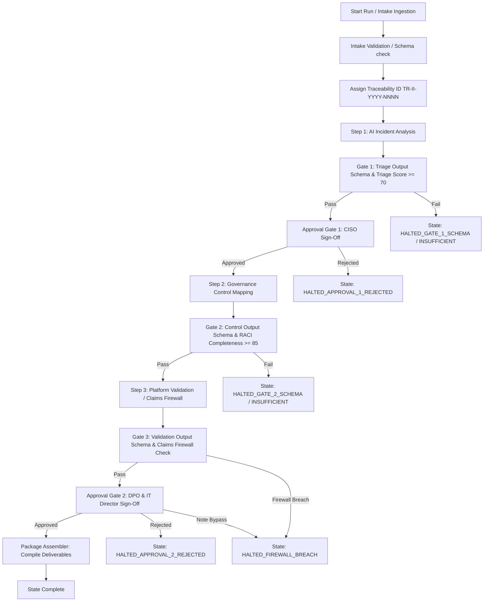

# Incident Intelligence Agent Runtime v0.1 — Architecture Report

**Document type:** Architecture Specification  
**Agent:** [Incident Intelligence Agent](file:///Users/ajayrajsingh/Documents/governance-os/agents/incident_intelligence_agent/AGENT.md)  
**Readiness Level:** L4 (Certified Production Ready)  
**Main Skills:** 
* [ai-incident-analysis](file:///Users/ajayrajsingh/Documents/governance-os/skills/ai-incident-analysis/SKILL.md)
* [governance-control-mapping](file:///Users/ajayrajsingh/Documents/governance-os/skills/governance-control-mapping/SKILL.md)
* [ethana-capability-validation](file:///Users/ajayrajsingh/Documents/governance-os/skills/ethana-capability-validation/SKILL.md)
**Status:** Implemented and Verified  

---

## 1. Executive Summary

The **Incident Intelligence Runtime v0.1** is a production runtime built on the Governance OS agent runtime framework. It coordinates the ingestion of raw AI/security incidents, performs multi-level analysis, plans remediation controls, validates those controls against the canonical product model, and outputs a signed handoff remediation package.

The runtime enforces strict governance boundaries. It protects against "workaround bypasses" and unreleased capabilities through a multi-gate validation pipeline. This includes automated schema validation, a dynamic **Claims Firewall** gate, and human CISO/DPO approval checkpoints prior to final package generation.

---

## 2. Component Reuse & Framework Alignment

The Incident Intelligence Runtime aligns with the core architectural requirements of Governance OS, reusing and extending the proven framework modules:

1.  **State Manager ([state_manager.py](file:///Users/ajayrajsingh/Documents/governance-os/agents/incident_intelligence_agent/runtime/state_manager.py)):** Manages persistent JSON state files for tracking incident runs. Validates transition contracts (preventing direct/invalid transitions like skipping approvals or bypassing firewalls).
2.  **Audit Logger ([audit_logger.py](file:///Users/ajayrajsingh/Documents/governance-os/agents/incident_intelligence_agent/runtime/audit_logger.py)):** Records timestamped, structured, append-only JSONL files verifying intake, analysis, control mapping, validation, firewall status, approvals, and compilation events.
3.  **Schema Validator ([schema_validator.py](file:///Users/ajayrajsingh/Documents/governance-os/agents/incident_intelligence_agent/runtime/schema_validator.py)):** Validates payloads across three main steps against defined schemas in the global [workflows/schemas/](file:///Users/ajayrajsingh/Documents/governance-os/workflows/schemas/) directory.
4.  **Claims Firewall (Truth Gate Integration):** Rather than treating the firewall as a separate runtime wrapper, it is integrated as the third dynamic execution step (`ethana-capability-validation` logic inside the `SkillExecutor`). It checks the mapped control design against the parsed canonical model, automatically blocking the release of unreleased features.

---

## 3. Runtime Lifecycle & Execution Flow

The Incident Intelligence assessment pipeline operates through the following steps:

### 3.1 Flow Breakdown

1.  **Trigger Intake & Validation:** Accepts trigger payloads containing incident descriptions and metadata. Matches them against [incident_assessment_input.schema.json](file:///Users/ajayrajsingh/Documents/governance-os/workflows/schemas/incident_assessment_input.schema.json). Assigns a unique ID (`TR-II-{YYYY}-{NNNN}`).
2.  **Step 1 — Triage (AI Incident Analysis):** Runs dynamic triage identifying the summary, proximate cause, 5-Whys, root cause, and recommended controls. Validates output against `incident_analysis_output.json`. Enforces a triage score check (default threshold >= 70).
3.  **Approval Gate 1 (CISO Approval):** Run transitions to `APPROVAL_1_PENDING` and halts for a human CISO sign-off (`submit_approval_1`). If approved, the pipeline proceeds to Step 2.
4.  **Step 2 — Control Mapping (Governance Control Mapping):** Formulates preventive, detective, and corrective controls based on triage findings, including an evidence registry and RACI matrix. Validates output against `control_mapping_output.json`. Enforces a control quality score check (fails if any accountable role in RACI is empty).
5.  **Step 3 — Truth Gate (Capability Validation & Claims Firewall):** Dynamically parses [canonical-product-model.md](file:///Users/ajayrajsingh/Documents/governance-os/knowledge/ethana/canonical-product-model.md) to cross-reference mapped controls. If a control uses an In Build or Aspirational capability without a documented manual workaround in the incident context, it triggers a Claims Firewall breach. Validates output against the full `ethana-capability-validation-output.schema.json`.
6.  **Approval Gate 2 (DPO / IT Director Containment Approval):** Run transitions to `APPROVAL_2_PENDING` and awaits containment setup sign-off (`submit_approval_2`). If the approver attempts to slip an unreleased feature in modification notes, the firewall automatically blocks it and transitions to `HALTED_FIREWALL_BREACH`.
7.  **Package Assembly:** Upon final approval, compiles signed remediation deliverables under `agents/incident_intelligence_agent/runtime/packages/{traceability_id}/`:
    *   `README.md`
    *   `{traceability_id}-incident-triage-report.md`
    *   `{traceability_id}-remediation-plan.md`
    *   `{traceability_id}-remediation-payload.json`
    *   `{traceability_id}-audit-log.jsonl`

---

## 4. Structured Output Contracts

The runtime enforces structural and contract compliance using schemas defined under [workflows/schemas/](file:///Users/ajayrajsingh/Documents/governance-os/workflows/schemas/):
*   **Intake Trigger Schema:** Validates type, description length, and input keys.
*   **Incident Analysis Schema:** Enforces standard taxonomy of proximate cause, contributing factors, root cause, and categorized control recommendations.
*   **Control Mapping Schema:** Enforces preventive/detective/corrective specifications, RACI records, and evidence requirements.
*   **Platform Validation Schema:** Enforces the complete Ethana Capability Validation format, including validated status, evidence confidence score (ECS), allowed/prohibited claims, and hard disqualifier list (HQ1–HQ7).
