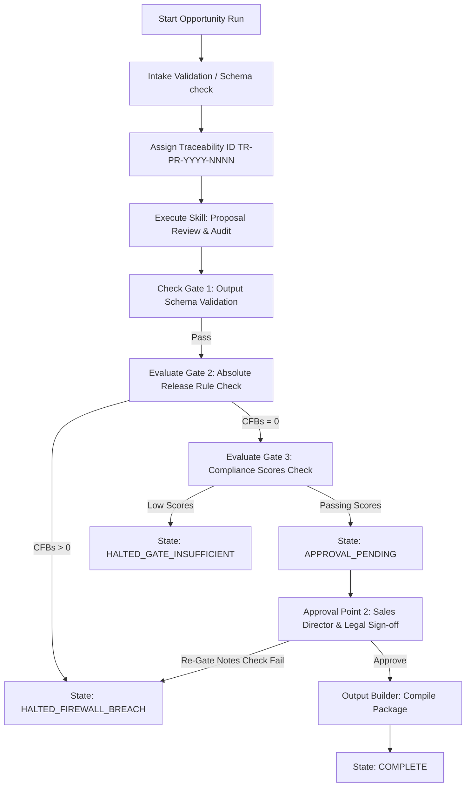

# Ethana Proposal Agent Runtime v0.1 — Architecture Report

**Document type:** Architecture Specification  
**Agent:** [Ethana Proposal Agent](file:///Users/ajayrajsingh/Documents/governance-os/agents/ethana_proposal_agent/AGENT.md)  
**Readiness Level:** L4 (Certified Production Ready)  
**Skill:** [ethana-proposal-review](file:///Users/ajayrajsingh/Documents/governance-os/skills/ethana-proposal-review/SKILL.md)  
**Status:** Implemented and Verified  

---

## 1. Executive Summary

The **Ethana Proposal Agent Runtime v0.1** is a production runtime designed to audit customer-facing documents (proposals, RFPs, Statements of Work) containing capability claims against the canonical product model. 

It executes the mandatory terminal gate (Claims Firewall) in the commercial proposal pipeline. It calculates two independent scoring constructs: the **Proposal Compliance Score (PCS)** and the **Claim Traceability Coverage Score (CTCS)**, enforces the 7 Traceability Gates (TG-1 through TG-7), and validates final Sales/Legal sign-offs before generating release-ready packages.

---

## 2. Component Reuse & Framework Alignment

The runtime reuses the standard agent modules from the Governance OS framework:
1.  **State Manager ([state_manager.py](file:///Users/ajayrajsingh/Documents/governance-os/agents/ethana_proposal_agent/runtime/state_manager.py)):** Coordinates transition rules (e.g. enforcing CISO/Legal approvals and halting on firewall breaches).
2.  **Audit Logger ([audit_logger.py](file:///Users/ajayrajsingh/Documents/governance-os/agents/ethana_proposal_agent/runtime/audit_logger.py)):** Structured append-only logging of runtime events.
3.  **Schema Validator ([schema_validator.py](file:///Users/ajayrajsingh/Documents/governance-os/agents/ethana_proposal_agent/runtime/schema_validator.py)):** Validates input triggers and outputs against JSON schemas in [workflows/schemas/](file:///Users/ajayrajsingh/Documents/governance-os/workflows/schemas/).
4.  **Claims Firewall:** Positioned at the terminal node, the firewall dynamically matches extracted claims against [canonical-product-model.md](file:///Users/ajayrajsingh/Documents/governance-os/knowledge/ethana/canonical-product-model.md) to detect Aspirational/In Build claims mapped as production, uncertified compliance statements, and unverified customer reference claims.

---

## 3. Runtime Lifecycle & Execution Flow

The Proposal Review pipeline operates through the following steps:

### 3.1 Flow Breakdown

1.  **Trigger Intake:** Validates opportunity inputs (draft proposal, Solution Mapping, and Feature Mapping outputs) against `proposal-review-input.schema.json`.
2.  **Skill Execution (Traceability & Status Audit):** The `SkillExecutor` parses the draft proposal, catalogues claims (Section 2), maps claim traceability (Section 3), and directly validates capability status (Section 4) against the canonical product model.
3.  **Validation Gates:**
    *   **Gate 1 (Schema Validator):** Verifies output conforms to `proposal-review-output.schema.json`.
    *   **Gate 2 (Absolute Release Rule):** If any Critical Firewall Breaches (CFB) are found, the pipeline overrides scores (`PCS = 0`) and transitions to `HALTED_FIREWALL_BREACH`.
    *   **Gate 3 (Compliance Scores):** Enforces minimum scores (PCS >= 80, CTCS >= 60). Failing scores halt the pipeline in `HALTED_GATE_INSUFFICIENT`.
4.  **Sign-off Gate:** Transitions to `APPROVAL_PENDING`. A Sales/Legal sign-off note containing unreleased platform keywords (e.g. `Visual Agent Builder`) will trigger an immediate claims firewall breach, halting in `HALTED_FIREWALL_BREACH`.
5.  **Deliverable Compilation:** Upon approval, packages deliverables under `/packages/{traceability_id}/`.
