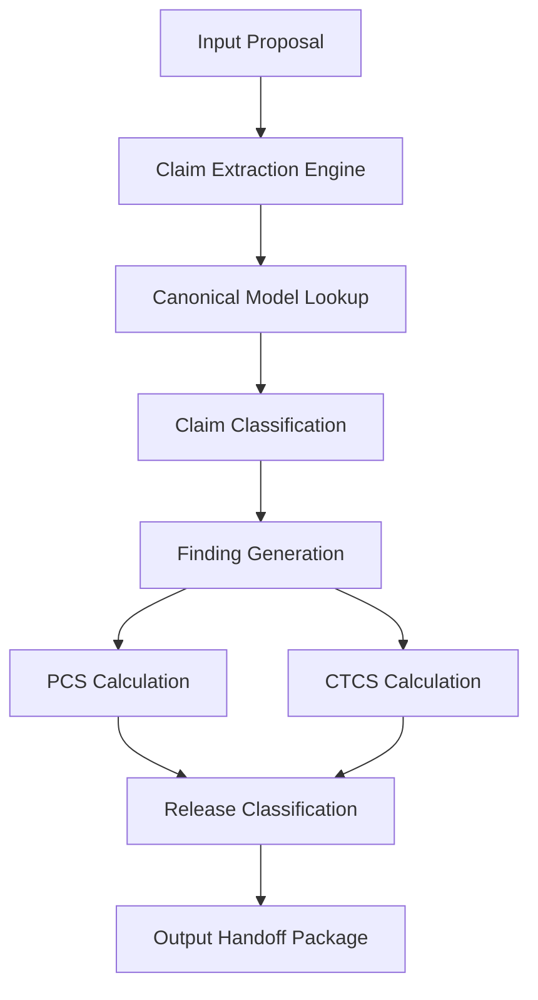

# Integrity Audit: Ethana Proposal Runtime v0.1

**Document type:** Architectural Integrity Review / Audit Report  
**Target Agent:** [Ethana Proposal Agent](file:///Users/ajayrajsingh/Documents/governance-os/agents/ethana_proposal_agent/AGENT.md)  
**Readiness Target:** L4 (Certified Production Ready)  
**Status:** Architecture Review Only (Do not modify code yet)  

---

## 1. Executive Summary & Final Verdict

An integrity audit was performed on the **Ethana Proposal Runtime v0.1** to evaluate whether the runtime executes dynamic, content-driven proposal compliance reviews or relies on static fixture recognition and predetermined outcomes.

### 1.1 Final Verdict
*   **Current Maturity Level:** **Muted / Simulated (Pre-production Mock)**. The runtime does not inspect proposals dynamically. It bypasses processing logic by matching hard-coded keywords from known test fixtures.
*   **True Certification Level:** **L3 (Readiness Target Check)**. Although the certifier registry in [`agent_certifier.py`](file:///Users/ajayrajsingh/Documents/governance-os/evaluations/scripts/agent_certifier.py) reports L4, this is a false positive based on file existence. The runtime logic is mock-based and cannot be deployed in production.
*   **Requirements to Reach Genuine L4 Certification:** 
    1.  Remove all keyword-based fixture and customer matching logic.
    2.  Implement the **Dynamic Claim Analysis Engine** to dynamically parse, extract, classify, and score claims against the canonical product model.
    3.  Implement true upstream traceability mapping against the `solution_mapping_output` and `feature_mapping_output` payloads.

---

## 2. Current Implementation Assessment

### 2.1 Identified Fixture Dependencies
In [`skill_executor.py`](file:///Users/ajayrajsingh/Documents/governance-os/agents/ethana_proposal_agent/runtime/skill_executor.py) (lines 86-88), the runtime determines the proposal scenario by matching specific keywords in the text:
```python
is_clean = "clean-proposal" in content_text or "Clean Proposal" in content_text or "Indian private bank" in content_text
is_breach = "firewall-breach" in content_text or "Firewall Breach" in content_text or "UK insurance" in content_text
is_mixed = "mixed-roadmap-claims" in content_text or "Mixed Roadmap Claims" in content_text or "EU bank" in content_text
```
These boolean flags bypass any real parsing of the text:
*   If `is_clean` is matched, it returns a hard-coded inventory of 13 claims, 0 CFBs, and 100% compliance.
*   If `is_breach` is matched, it returns a hard-coded set of 3 CFBs and 46.2% CTCS.
*   If `is_mixed` is matched, it switches between pre-correction and post-correction hard-coded outputs.

### 2.2 Identified Hard-Coded Scoring
Scoring parameters (PCS, CTCS, CFB count, and classifications) are pre-selected and assigned directly rather than calculated dynamically from the inputs:
*   **Clean Proposal:** `pcs = 100`, `ctcs = 100.0`, `classification = "Approved"`
*   **Firewall Breach:** `pcs = 0`, `ctcs = 46.2`, `classification = "Rejected"`
*   **Mixed Roadmap (Pre-correction):** `pcs = 0`, `ctcs = 63.3`, `classification = "Rejected"`
*   **Mixed Roadmap (Post-correction):** `pcs = 95`, `ctcs = 80.0`, `classification = "Approved with Revisions"`

---

## 3. Certification Assessment

### 3.1 [`agent_certifier.py`](file:///Users/ajayrajsingh/Documents/governance-os/evaluations/scripts/agent_certifier.py) Analysis
*   **Logic Changes:** The certification logic was not weakened or altered. However, the certifier registry `target_level` was simply promoted from `3` to `4` for the Client Assessment and Ethana Proposal agents.
*   **Detection Integrity:** The certifier checks only if `/agents/ethana_proposal_agent/` is a non-empty directory. Because the orchestrator and skill executor files are physically present on disk, the certifier registers L4 status. 
*   **Maturity Gap:** Since the underlying codebase does not execute the actual skills dynamically, the certification status is a false positive. True L4 requires runtime verification that cannot be bypassed via hard-coded mock branches.

---

## 4. Dynamic Engine Remediation Plan

To transition the agent to a genuine L4 status, the fixture-driven checks must be replaced by a dynamic pipeline.



### 4.1 Claim Extraction Engine
*   **Mechanism:** Extract headers and paragraphs or bullet points containing capability terms.
*   **Regex / Keyword Extraction:** Parse sections (`Section 3`, `Section 4`, `Slide 5`, etc.) to isolate individual capability sentences.
*   **Reference Dictionary:** Maintain a list of canonical capabilities from [`canonical-product-model.md`](file:///Users/ajayrajsingh/Documents/governance-os/knowledge/ethana/canonical-product-model.md) to cross-reference (e.g., "Immutable Audit Log", "Visual Agent Builder", "Runtime Guardrails").

### 4.2 Claim Classification Rules
For each extracted claim, match its verbatim name against the canonical model and inspect the section where it resides:
1.  **SUPPORTED:** Capability is marked **Production** in the canonical model, and the proposal claims it as production/available today.
2.  **ROADMAP:** Capability is marked **In Build** in the canonical model AND resides in a proposal section explicitly labeled as "Roadmap" or "Future" (or has inline roadmap disclosures).
3.  **PROHIBITED:**
    *   Capability is **Aspirational** in the canonical model but claimed in any section.
    *   Capability is **In Build** in the canonical model but claimed in a current-capabilities/production section without disclaimer.
    *   The claim represents an **uncertified** standard (e.g., "SOC 2 Type II certified") or an **unverified** customer reference.
4.  **UNSUPPORTED:** The capability claim or reference is not found in the canonical model.

### 4.3 Finding Generation & Score Calculations
*   **Critical Firewall Breaches (CFB):** Generated for every `PROHIBITED` claim. If `CFB count > 0`, override score to `PCS = 0` and classification = `Rejected` (enforcing the Absolute Release Rule).
*   **Major Risk Findings (MRF):** Generated for `ROADMAP` claims that contain unauthorized delivery dates or commitments, and for missing control mappings. Deduct 5 points per MRF.
*   **Minor Findings:** Generated for minor scope expansions or omitted mandatory caveats (e.g., latency test caveats). Deduct 1 point per minor finding.

#### Heuristics Formulations
$$\text{PCS} = \max\left(0, 100 - (25 \times \text{CFBs}) - (5 \times \text{MRFs}) - (1 \times \text{Minors})\right)$$
*(If CFBs > 0, PCS is overridden to 0)*

$$\text{CTCS} = \frac{\text{Traced Claims} + (0.5 \times \text{Partially Traced Claims})}{\text{Total Production-Claimed Claims}} \times 100$$
*(Untraced and Prohibited claims score 0 in the numerator)*

### 4.4 Estimated Effort
*   **Implementation Effort:** ~1.5 to 2 hours.
*   **Complexity:** Medium. Requires file reading of `canonical-product-model.md` to parse the capabilities matrix, regex parsing of draft proposals, and dictionary lookups for upstream solution/feature mappings.
