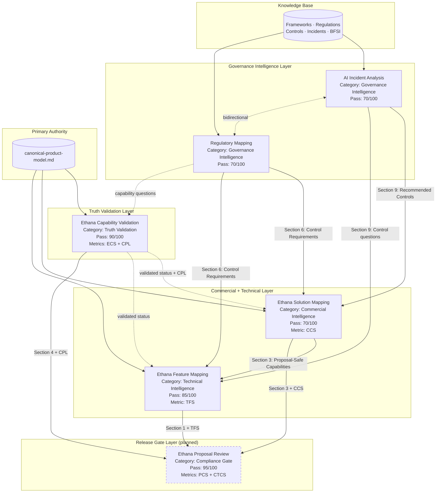

# Governance OS — Skill Architecture Assessment

**Date of Assessment:** 2026-06-17
**Repository State:** 5 skills committed, 0 agents, 0 workflows, 0 evaluations (central)
**Scope:** Architecture-only assessment — no files created or modified

---

## 1. Skill Inventory

### 1.1 AI Incident Analysis

| Field | Detail |
|---|---|
| **Directory** | `skills/ai-incident-analysis/` |
| **Category** | Governance Intelligence |
| **Purpose** | Analyses AI incidents (security, agent failures, model failures, governance events) and produces a standardised 10-section governance assessment. Converts raw incident reports into reusable governance artefacts with root cause analysis, framework mapping, control failure identification, and recommended controls. |
| **Primary authority** | Knowledge base (frameworks, regulations, controls, incidents) — no single canonical file |
| **Scoring metric** | Section-weighted rubric (100 points across 10 sections) |
| **Pass threshold** | 70/100 |
| **Hard disqualifiers** | None defined |

**Inputs:**

| Input | Required | Description |
|---|---|---|
| `incident_description` | Yes | Raw incident description — news article, internal report, regulatory notice, research publication |
| `incident_type` | Yes | AI Security Incident / Agent Failure / Model Failure / Data Incident / Governance Event / Bias & Fairness Incident |
| `organisation_context` | No | Industry, size, AI maturity |
| `date` | No | Incident date |
| `source` | No | Internal / public / research / regulator |
| `affected_system` | No | AI system or product involved |
| `client_context` | No | Client sector and AI portfolio profile |

**Outputs (10 sections):**

| # | Section | Key content |
|---|---|---|
| 1 | Incident Summary | Executive-level factual summary (≤200 words) |
| 2 | Root Cause Analysis | Proximate cause → contributing factors → root cause (5 Whys) |
| 3 | Risk Category | Primary + up to 2 secondary categories from defined taxonomy |
| 4 | Control Failures | Absent / inadequate design / inadequate operation |
| 5 | Applicable Frameworks | ISO 42001, NIST AI RMF, OWASP LLM Top 10 |
| 6 | Regulatory Implications | Jurisdictions engaged, provisions implicated, notification obligations |
| 7 | BFSI Impact | Sector-specific exposure and control gaps |
| 8 | Lessons Learned | Transferable insights with applicability and urgency |
| 9 | Recommended Controls | Prioritised controls with implementation complexity and framework reference |
| 10 | Executive Summary | Board-level summary (150–200 words) |

**Knowledge dependencies:**
- `knowledge/frameworks/` (ISO 42001, NIST AI RMF, OWASP LLM Top 10)
- `knowledge/regulations/` (EU AI Act, UK AI Guidance, India AI Landscape)
- `knowledge/controls/` (prompt injection, agent governance, data protection, audit, model risk)
- `knowledge/ai-incidents/` (precedent library)

**Upstream skills:** None — this is a root skill. Accepts raw incident input.

**Downstream skills (declared):**
- `skills/risk-assessment/` ← **does not exist**
- `skills/framework-gap-analysis/` ← **does not exist**
- `skills/regulatory-exposure/` ← **does not exist**

**Downstream skills (actual, by output consumption):**
- `skills/ethana-solution-mapping/` — accepts Section 9 (Recommended Controls) as input
- `skills/ethana-feature-mapping/` — accepts recommended controls as feature validation questions
- `skills/regulatory-mapping/` — shares framework and regulatory knowledge; bidirectional relationship

---

### 1.2 Regulatory Mapping

| Field | Detail |
|---|---|
| **Directory** | `skills/regulatory-mapping/` |
| **Category** | Governance Intelligence |
| **Purpose** | Maps AI use cases, incidents, controls, and systems to applicable regulations and governance frameworks across jurisdictions (EU, UK, India). Produces a 9-section assessment identifying applicable laws, obligations, risk classifications, documentation requirements, control requirements, and audit evidence needs. |
| **Primary authority** | Knowledge base (regulations, frameworks, BFSI, controls) — no single canonical file |
| **Scoring metric** | Section-weighted rubric (100 points across 9 sections) |
| **Pass threshold** | 70/100 |
| **Hard disqualifiers** | None defined |

**Inputs:**

| Input | Required | Description |
|---|---|---|
| `subject_description` | Yes | AI use case, system, incident, or control to be mapped |
| `subject_type` | Yes | AI Use Case / AI System / AI Incident / AI Control / AI Portfolio |
| `jurisdictions` | Yes | EU / UK / India |
| `industry` | No | Sector (critical for BFSI, healthcare) |
| `data_types` | No | Personal / financial / health / biometric / public |
| `affected_individuals` | No | Employees / customers / public / minors |
| `deployment_model` | No | Cloud / on-prem / hybrid / third-party SaaS / GCC |
| `client_context` | No | Sector, size, AI maturity, regulatory relationships |
| `ai_technology` | No | LLM / ML classifier / computer vision / NLP / agent / ensemble |

**Outputs (9 sections):**

| # | Section | Key content |
|---|---|---|
| 1 | Applicable Regulations | Jurisdiction-by-jurisdiction regulation identification with triggers |
| 2 | Applicable Governance Frameworks | ISO 42001 clauses, NIST AI RMF functions, OWASP LLM Top 10 |
| 3 | Regulatory Obligations | Specific obligations with legal citations, types, timelines, penalties |
| 4 | Risk Classification | EU AI Act / UK PRA SS1/23 / India DPDP Act classifications |
| 5 | Documentation Requirements | Required documents with regulatory source and content requirements |
| 6 | Control Requirements | Mandatory and recommended controls with regulatory source |
| 7 | Audit Evidence Required | Evidence items with purpose, source, retention, format |
| 8 | BFSI Considerations | Sector-specific regulatory frameworks, model risk, consumer impact |
| 9 | Executive Summary | Board-level summary (200–250 words) |

**Knowledge dependencies:**
- `knowledge/frameworks/` (ISO 42001, NIST AI RMF, OWASP LLM Top 10)
- `knowledge/regulations/` (EU AI Act, UK AI Guidance, India AI Landscape)
- `knowledge/controls/` (all control categories)
- `knowledge/bfsi/` (banking, insurance, wealth management, GCC)
- `knowledge/ethana/capability-status.md` and `knowledge/ethana/framework-crosswalk.md`

**Upstream skills:**
- `skills/ai-incident-analysis/` — incident reports can be input subjects

**Downstream skills (declared):**
- `skills/ai-incident-analysis/` — bidirectional; incidents needing full governance analysis
- `skills/governance-control-mapping/` ← **does not exist**
- `skills/ethana-solution-mapping/` — regulatory control requirements feed into solution mapping
- `skills/iso-42001-gap-assessment/` ← **does not exist**

**Downstream skills (actual, by output consumption):**
- `skills/ethana-solution-mapping/` — accepts Section 6 (Control Requirements) as primary input
- `skills/ethana-feature-mapping/` — accepts Section 6 (Control Requirements) as input

---

### 1.3 Ethana Capability Validation

| Field | Detail |
|---|---|
| **Directory** | `skills/ethana-capability-validation/` |
| **Category** | Truth Validation |
| **Purpose** | Determines whether a specific Ethana capability can be legitimately claimed, what evidence supports the claim, what status the capability should carry (Production / In Build / Aspirational), and what customer-facing language is permitted or prohibited. The foundational truth-validation layer for all Ethana-facing skills. |
| **Primary authority** | `knowledge/ethana/canonical-product-model.md` — sole permitted source for status determinations |
| **Scoring metrics** | Evidence Confidence Score (ECS, 0–100) + Claim Permission Level (CPL, 1–5) |
| **Pass threshold** | 90/100 |
| **Hard disqualifiers** | 7 (HQ1–HQ7) |

**Inputs:**

| Input | Required | Description |
|---|---|---|
| `capability_name` | At least 1 of 3 | Name of the capability to validate |
| `proposed_claim` | At least 1 of 3 | Specific sentence someone wants to say or write |
| `source_document` | At least 1 of 3 | Document making a capability claim needing validation |
| `claim_context` | No | Formal Proposal / RFP Response / Marketing / Discovery / Internal / Engineering |
| `requesting_team` | No | Product / Sales / Advisory / Technical |
| `jurisdiction` | No | EU / UK / India / Global |
| `contradiction_sources` | No | Named sources making conflicting claims |

**Outputs (9 sections):**

| # | Section | Key content |
|---|---|---|
| 1 | Capability Status Determination | Validated status + source + caveats + scope boundaries + confidence |
| 2 | Evidence Sufficiency Summary | Quick-reference CPL and sufficiency per claim |
| 3 | Evidence Register | All sources examined with authority levels |
| 4 | Allowed Claims | Quotable claim language with CPL per entry |
| 5 | Prohibited Claims | CPL-5 claims with prohibition reason and risk |
| 6 | Contradiction Log | Source conflicts with adjudication |
| 7 | Evidence Confidence Score (ECS) | Full arithmetic with path and adjustments |
| 8 | Escalation Recommendation | Recipient, specific question, interim position |
| 9 | Validation Audit Trail | Complete validation record with gate confirmation |

**Knowledge dependencies:**
- **Tier 1 (Primary):** `knowledge/ethana/canonical-product-model.md`
- **Tier 2 (Secondary):** `knowledge/ethana/product-architecture-investigation.md`, `knowledge/ethana/use-cases.md`
- **Tier 3 (Reference only):** Marketing playbook, board deck
- **Tier 4 (Prohibited):** `capability-status.md`, `source-of-truth.md`, `ethana-status-reconciliation.md`

**Upstream skills:** None — this is a root skill for the Ethana chain. May receive questions from `skills/regulatory-mapping/`.

**Downstream skills (declared):**
- `skills/ethana-solution-mapping/` — consumer of validated status and CPL
- `skills/ethana-feature-mapping/` — consumer of validated status for TFS grounding
- `skills/regulatory-mapping/` — may generate capability questions (bidirectional)

---

### 1.4 Ethana Solution Mapping

| Field | Detail |
|---|---|
| **Directory** | `skills/ethana-solution-mapping/` |
| **Category** | Commercial Intelligence |
| **Purpose** | Maps governance requirements, regulatory obligations, and customer use cases to Ethana platform capabilities. Scores coverage confidence, produces proposal-safe claim language, positions Ethana competitively, and recommends the optimal commercial motion. The commercial translation layer of the Governance OS. |
| **Primary authority** | `knowledge/ethana/canonical-product-model.md` |
| **Scoring metric** | Coverage Confidence Score (CCS, 0–100) |
| **Pass threshold** | 70/100 |
| **Hard disqualifiers** | 4 |

**Inputs:**

| Input | Required | Description |
|---|---|---|
| `requirement_list` | At least 1 of 3 | Governance/control requirements from upstream skills, RFPs, or free text |
| `capability_question` | At least 1 of 3 | Direct question about platform capability |
| `customer_use_case` | At least 1 of 3 | Customer problem statement |
| `customer_sector` | No | BFSI / Healthcare / Government / General Enterprise |
| `jurisdictions` | No | EU / UK / India |
| `output_mode` | No | Formal Proposal / RFP Response / Discovery Conversation |
| `deployment_constraint` | No | Cloud / Customer VPC / On-prem / Air-gapped |
| `existing_subscription` | No | None / Build / Edge / Bundle |
| `upstream_skill_output` | No | Output from regulatory-mapping or ai-incident-analysis |
| `competitive_context` | No | Known alternatives customer is evaluating |

**Outputs (10 sections):**

| # | Section | Key content |
|---|---|---|
| 1 | Requirement Coverage Map | Per-requirement CCS score and disposition |
| 2 | Coverage Confidence Summary | Aggregate CCS, coverage characterisation |
| 3 | Proposal-Safe Platform Capabilities | Quotable Production capability language |
| 4 | Roadmap Disclosure | In Build items with Cursory bridge |
| 5 | Prohibited Claims Register | Aspirational and In Build items that must not appear |
| 6 | Cursory Bridge Recommendations | Named services for each gap |
| 7 | Gap Register | Requirements Ethana cannot address |
| 8 | Competitive Positioning | Differentiated strengths, honest gaps, win/loss conditions |
| 9 | Recommended Commercial Motion | Platform-First / Advisory-First / Land-and-Expand / Design Partner |
| 10 | Customer-Facing Executive Summary | 200–250 words for proposal cover letter |

**Knowledge dependencies:**
- **Tier 1:** `knowledge/ethana/canonical-product-model.md`
- **Tier 2:** `product-architecture-investigation.md`, `use-cases.md`, `competitor-positioning.md`
- **Tier 3:** Framework crosswalks (ISO 42001, NIST AI RMF, OWASP, regulations)
- **Tier 4 (Upstream outputs):** `skills/regulatory-mapping/` Section 6, `skills/ai-incident-analysis/` Section 9

**Upstream skills (actual):**
- `skills/regulatory-mapping/` — Section 6 (Control Requirements) is the most common input
- `skills/ai-incident-analysis/` — Section 9 (Recommended Controls) accepted as input
- `skills/ethana-capability-validation/` — implicit; status determinations should be pre-validated

**Downstream skills (declared):**
- `skills/governance-control-mapping/` ← **does not exist**
- `skills/iso-42001-gap-assessment/` ← **does not exist**

**Downstream skills (actual):**
- `skills/ethana-feature-mapping/` — Section 3 (Proposal-Safe Capabilities) is its most common input

---

### 1.5 Ethana Feature Mapping

| Field | Detail |
|---|---|
| **Directory** | `skills/ethana-feature-mapping/` |
| **Category** | Technical Intelligence |
| **Purpose** | Validates specific Ethana features against a customer's technical context. Answers whether a feature works for a specific environment, can substitute an existing tool feature, and is ready for a proof of concept. Operates one level deeper than Solution Mapping. |
| **Primary authority** | `knowledge/ethana/canonical-product-model.md` |
| **Scoring metric** | Technical Fit Score (TFS, 0–100) |
| **Pass threshold** | 85/100 |
| **Hard disqualifiers** | 5 |

**Inputs:**

| Input | Required | Description |
|---|---|---|
| `feature_question` | At least 1 of 5 | Specific technical question about an Ethana feature |
| `technical_requirement` | At least 1 of 5 | Technical constraints the feature must satisfy |
| `existing_tool_feature_list` | At least 1 of 5 | Features of customer's current tool for substitution analysis |
| `poc_scope` | At least 1 of 5 | Proposed POC scope for feasibility validation |
| `upstream_skill_output` | At least 1 of 5 | Solution Mapping Section 3 or Regulatory Mapping Section 6 |
| `deployment_constraint` | No | Cloud / Customer VPC / On-prem / Air-gapped |
| `existing_stack` | No | Named tools in customer's stack |
| `customer_sector` | No | BFSI / Healthcare / Government / General Enterprise |
| `volume_parameters` | No | LLM call volume, user count, data volume |
| `poc_duration` | No | 30 / 60 / 90 days |
| `output_mode` | No | Technical Evaluation / POC Scope / RFI Response / Internal Memo |

**Outputs (10 sections):**

| # | Section | Key content |
|---|---|---|
| 1 | Feature Validation Table | Per-feature TFS score with status, description, constraints, evidence |
| 2 | Technical Fit Summary | Average TFS, distribution, technical characterisation, POC readiness |
| 3 | Integration Compatibility Assessment | Integration type, configuration steps, schema mapping per stack component |
| 4 | Technical Constraints and Caveats | Hard technical limitations for this customer context |
| 5 | POC Feature Set | Included features with test scenarios, prerequisites, success criteria |
| 6 | Prohibited Feature Claims Register | In Build, Aspirational, unconfirmed integration claims |
| 7 | Substitution Analysis | Feature-by-feature comparison with customer's existing tool |
| 8 | Evidence References | Source table for every technical claim |
| 9 | Technical Proposal Language | Feature-level claim language for technical audience |
| 10 | Technical Summary | 150–200 word technical decision memo |

**Knowledge dependencies:**
- **Tier 1:** `knowledge/ethana/canonical-product-model.md`
- **Tier 2:** `product-architecture-investigation.md`, `use-cases.md`, `competitor-positioning.md`
- **Tier 3:** Framework crosswalks (OWASP, India, EU, UK regulations)
- **Tier 4 (Upstream outputs):** `skills/ethana-solution-mapping/` Section 3, `skills/regulatory-mapping/` Section 6

**Upstream skills (actual):**
- `skills/ethana-solution-mapping/` — Section 3 is the most common input
- `skills/regulatory-mapping/` — Section 6 when technical requirements derive from regulatory mapping
- `skills/ai-incident-analysis/` — recommended controls may generate feature validation questions
- `skills/ethana-capability-validation/` — implicit; status determinations should be pre-validated

**Downstream skills (declared):**
- `skills/governance-control-mapping/` ← **does not exist**

**Downstream skills (actual):** None currently implemented.

---

## 2. Skill Dependency Graph



### Data Flow Summary

| Source skill | Output section | Consumer skill | Consumer input |
|---|---|---|---|
| AI Incident Analysis | Section 9 (Recommended Controls) | Ethana Solution Mapping | `upstream_skill_output` |
| AI Incident Analysis | Section 9 (Recommended Controls) | Ethana Feature Mapping | Feature validation questions |
| Regulatory Mapping | Section 6 (Control Requirements) | Ethana Solution Mapping | `upstream_skill_output` (most common input) |
| Regulatory Mapping | Section 6 (Control Requirements) | Ethana Feature Mapping | `upstream_skill_output` |
| Ethana Capability Validation | Section 4 (Allowed Claims) + CPL | Ethana Solution Mapping | Implicit — status authority |
| Ethana Capability Validation | Section 1 (Status) | Ethana Feature Mapping | Implicit — status grounding |
| Ethana Solution Mapping | Section 3 (Proposal-Safe Capabilities) | Ethana Feature Mapping | `upstream_skill_output` (most common input) |

---

## 3. Architectural Observations

### 3.1 Two Distinct Skill Families

The repository contains two skill families that share knowledge base resources but operate in different domains:

| Family | Skills | Primary concern | Authority source |
|---|---|---|---|
| **Governance Intelligence** | AI Incident Analysis, Regulatory Mapping | Framework alignment, regulatory compliance, control identification | Knowledge base (frameworks, regulations, controls) |
| **Ethana Commercial Chain** | Capability Validation → Solution Mapping → Feature Mapping | Product truth enforcement, commercial proposal safety, technical validation | `canonical-product-model.md` |

The two families connect through a well-defined interface:
- Regulatory Mapping Section 6 (Control Requirements) feeds into Solution Mapping and Feature Mapping
- AI Incident Analysis Section 9 (Recommended Controls) feeds into Solution Mapping and Feature Mapping

This interface is clean and well-documented.

### 3.2 Escalating Quality Standards

The Ethana chain enforces progressively stricter quality standards as outputs move closer to customer-facing documents:

| Skill | Pass threshold | Hard disqualifiers | Rationale |
|---|---|---|---|
| Ethana Solution Mapping | 70/100 | 4 | Commercial intelligence — errors are serious but can be caught downstream |
| Ethana Feature Mapping | 85/100 | 5 | Technical commitments (POC scope) — directly acted upon by engineers |
| Ethana Capability Validation | 90/100 | 7 (HQ1–HQ7) | Foundational truth gate — errors propagate to all downstream outputs |
| Ethana Proposal Review (planned) | 95/100 | 7 (HD1–HD7) | Final release gate — errors reach the customer |

The Governance Intelligence family uses a flat 70/100 threshold for both skills. This is appropriate given their advisory nature — they produce intelligence, not customer-facing claims.

### 3.3 Implicit vs. Explicit Dependency on Capability Validation

Ethana Solution Mapping and Ethana Feature Mapping both depend on `canonical-product-model.md` directly. They do not formally require a Capability Validation output as input. The dependency is implicit:

- Solution Mapping consults `canonical-product-model.md` during its own Phase 3 (Canonical Model Lookup)
- Feature Mapping consults `canonical-product-model.md` during its own Phase 2 (Feature Identification and Status Verification)

This means that Solution Mapping and Feature Mapping can execute **without** a prior Capability Validation run. They perform their own status lookups. Capability Validation is the authoritative arbiter when there is a dispute or ambiguity, but it is not a hard prerequisite.

> [!IMPORTANT]
> This is a deliberate architectural choice, not an oversight. Requiring Capability Validation before every Solution Mapping or Feature Mapping run would create an impractical bottleneck. However, it means that Solution Mapping and Feature Mapping can produce outputs with status determinations that have not been formally validated. The planned Proposal Review skill addresses this gap by checking upstream traceability.

### 3.4 Knowledge Source Inconsistency

Regulatory Mapping lists `knowledge/ethana/capability-status.md` as a knowledge dependency. This file is classified as **Tier 4 — PROHIBITED** by Ethana Capability Validation and is explicitly superseded by `canonical-product-model.md` in that file's header.

This inconsistency does not cause a functional problem today because Regulatory Mapping does not make Ethana status determinations — it maps regulations to subjects. However, if a future workflow chains Regulatory Mapping into Solution Mapping without the `canonical-product-model.md` filter, a status conflict could propagate.

---

## 4. Missing Skills (Phantom References)

The following skills are referenced in the `Related Skills` sections of existing skills but **do not exist** in the repository:

| Phantom skill | Referenced by | Declared purpose |
|---|---|---|
| `skills/risk-assessment/` | AI Incident Analysis | Translating incident findings into a client risk register |
| `skills/framework-gap-analysis/` | AI Incident Analysis | Converting control failure findings into a gap assessment |
| `skills/regulatory-exposure/` | AI Incident Analysis | Deeper jurisdictional regulatory analysis |
| `skills/governance-control-mapping/` | Regulatory Mapping, Solution Mapping, Feature Mapping | Translating control requirements into specific implementation designs |
| `skills/iso-42001-gap-assessment/` | Regulatory Mapping, Solution Mapping | Detailed ISO 42001 gap analysis following framework identification |

### Analysis

| Phantom skill | Priority | Rationale |
|---|---|---|
| **`governance-control-mapping`** | **High** | Referenced by 3 existing skills. Fills a clear gap: existing skills identify *what controls are needed* but no skill maps those controls to *specific implementation designs*. This is the bridge between advisory output and customer implementation. |
| **`iso-42001-gap-assessment`** | **Medium** | Referenced by 2 existing skills. ISO 42001 is the most operationally relevant framework for enterprise AI governance programmes. A dedicated gap assessment skill would serve the advisory team directly. |
| **`regulatory-exposure`** | **Low** | Referenced by 1 skill only. Significant functional overlap with Regulatory Mapping — which already produces jurisdictional obligation analysis. May be absorbed into Regulatory Mapping as a deeper output mode rather than a separate skill. |
| **`risk-assessment`** | **Low** | Referenced by 1 skill only. Functional overlap with the control requirements and gap analysis outputs of Regulatory Mapping and the planned `governance-control-mapping` skill. |
| **`framework-gap-analysis`** | **Low** | Referenced by 1 skill only. Likely a subset of `iso-42001-gap-assessment` or a generalised version covering multiple frameworks. |

---

## 5. Redundancy Analysis

### 5.1 No Redundant Skills

No two existing skills produce the same output for the same input. Each skill occupies a distinct position in the architecture:

| Dimension | AI Incident Analysis | Regulatory Mapping | Capability Validation | Solution Mapping | Feature Mapping |
|---|---|---|---|---|---|
| **Question** | What happened and why? | What regulations apply? | Can this be claimed? | What can we propose? | Does this feature work here? |
| **Input** | Incident report | AI subject + jurisdictions | Capability name / claim | Governance requirements | Feature questions / tech requirements |
| **Output** | Root cause + controls + frameworks | Obligations + classifications + controls | Status + ECS + CPL + allowed/prohibited claims | Proposal language + CCS + commercial motion | Technical validation + TFS + POC scope |
| **Audience** | Risk, compliance, executive | Compliance, legal, advisory | Any claimant | Advisory team | Solution architects, technical evaluators |

### 5.2 Functional Overlap (Acceptable)

Two areas of functional overlap exist but are architecturally intentional:

1. **Framework mapping appears in both AI Incident Analysis (Section 5) and Regulatory Mapping (Section 2).** This is acceptable because the two skills apply frameworks for different purposes — incident analysis maps frameworks to *what went wrong*; regulatory mapping maps frameworks to *what must be done*.

2. **Status lookup from canonical-product-model.md occurs in Capability Validation, Solution Mapping, and Feature Mapping.** This is acceptable because Capability Validation performs deep adjudication with evidence scoring, while Solution Mapping and Feature Mapping perform lightweight lookups. See §3.3.

### 5.3 Potential Future Redundancy Risk

If `regulatory-exposure`, `risk-assessment`, and `framework-gap-analysis` are all built as separate skills, the Governance Intelligence layer would have 5 skills with significant functional overlap. Recommendation: consolidate into 2 additional skills maximum (see §7).

---

## 6. Recommended Workflow Chains

### 6.1 Advisory-to-Proposal Chain (Primary)

The most common end-to-end workflow. Used when a customer engagement moves from discovery to proposal.

```
Customer requirement
      │
      ▼
┌─────────────────────┐
│ Regulatory Mapping   │  ← Identifies applicable regulations and control requirements
│ Section 6 output     │
└─────────┬───────────┘
          │
          ▼
┌─────────────────────────┐
│ Ethana Solution Mapping  │  ← Maps requirements to Ethana capabilities, produces proposal language
│ Section 3 output         │
└─────────┬───────────────┘
          │
          ▼
┌─────────────────────────┐
│ Ethana Feature Mapping   │  ← Validates technical feasibility, produces POC scope
│ Full output              │
└─────────┬───────────────┘
          │
          ▼
┌─────────────────────────┐
│ Draft Proposal           │  ← Human or assembled from upstream outputs
└─────────┬───────────────┘
          │
          ▼
┌──────────────────────────┐
│ Ethana Proposal Review    │  ← Final compliance gate (planned)
│ Release Classification    │
└──────────────────────────┘
```

**When to add Capability Validation:** Insert before Solution Mapping when a specific capability's status is disputed, ambiguous, or newly released.

### 6.2 Incident-to-Capability Chain

Used when an AI incident reveals a governance gap and the team wants to determine whether Ethana addresses it.

```
Incident report
      │
      ▼
┌─────────────────────┐
│ AI Incident Analysis │  ← Root cause, control failures, recommended controls
│ Section 9 output     │
└─────────┬───────────┘
          │
          ▼
┌─────────────────────────┐
│ Ethana Solution Mapping  │  ← Maps recommended controls to Ethana capabilities
│ Section 3 output         │
└─────────┬───────────────┘
          │
          ▼
┌─────────────────────────┐
│ Ethana Feature Mapping   │  ← Validates technical feasibility of the solution
│ Full output              │
└──────────────────────────┘
```

### 6.3 Capability Dispute Chain

Used when a specific capability claim needs formal adjudication before appearing in any output.

```
Disputed claim / conflicting sources
      │
      ▼
┌──────────────────────────────┐
│ Ethana Capability Validation  │  ← Full 9-section validation with ECS and CPL
│ Section 4 + Section 5 output │
└─────────┬────────────────────┘
          │
          ├──── Section 4 (Allowed Claims) ──► Solution Mapping, Feature Mapping, Proposal Review
          │
          └──── Section 5 (Prohibited Claims) ──► Solution Mapping, Feature Mapping, Proposal Review
```

### 6.4 Multi-Jurisdictional Compliance Chain

Used for cross-border engagements requiring regulatory + framework + capability mapping.

```
Customer AI portfolio + jurisdictions
      │
      ▼
┌─────────────────────┐
│ Regulatory Mapping   │  ← Multi-jurisdiction obligation mapping
│ Full output          │
└─────────┬───────────┘
          │
          ├──── Section 6 (Control Requirements) ──► Solution Mapping
          │
          └──── Section 5 (Documentation Requirements) ──► Advisory team (manual)
```

### 6.5 Incident Intelligence Chain

Used for proactive incident monitoring and knowledge base updates.

```
Public incident report
      │
      ▼
┌─────────────────────┐
│ AI Incident Analysis │  ← Full 10-section governance assessment
│ Full output          │
└─────────┬───────────┘
          │
          ├──── Append to knowledge/ai-incidents/ (manual)
          │
          └──── Section 6 (Regulatory Implications) ──► Regulatory Mapping (if client-relevant)
```

---

## 7. Recommended Future Skills

Based on the phantom reference analysis (§4), architectural gaps, and workflow chain requirements, the following skills are recommended in priority order:

### Priority 1 — Ethana Proposal Review

**Status:** Architecture approved (v2). Awaiting file generation.
**Justification:** Completes the Ethana commercial chain. Without it, the chain from Capability Validation → Solution Mapping → Feature Mapping has no final compliance gate. Every proposal currently relies on human review to catch claims firewall violations.

### Priority 2 — Governance Control Mapping

**Referenced by:** 3 existing skills (Regulatory Mapping, Solution Mapping, Feature Mapping)
**Purpose:** Translates regulatory control requirements and recommended controls into specific implementation designs — control architectures, evidence procedures, monitoring configurations.
**Justification:** The highest-referenced phantom skill. Fills the gap between "what controls are needed" (Regulatory Mapping Section 6, AI Incident Analysis Section 9) and "what to implement" (customer-facing control design).
**Inputs:** Regulatory Mapping Section 6, AI Incident Analysis Section 9, Solution Mapping Section 6 (Cursory Bridge Recommendations)
**Outputs:** Control implementation designs, evidence collection procedures, monitoring configurations

### Priority 3 — ISO 42001 Gap Assessment

**Referenced by:** 2 existing skills (Regulatory Mapping, Solution Mapping)
**Purpose:** Dedicated gap assessment against ISO 42001 Annex A controls. Produces a structured gap table with maturity scoring per control domain.
**Justification:** ISO 42001 is the most operationally relevant framework for enterprise AI governance. Advisory engagements frequently begin with an ISO 42001 gap assessment. Regulatory Mapping identifies ISO 42001 applicability; this skill performs the detailed assessment.
**Inputs:** Regulatory Mapping Section 2 (Applicable Frameworks), client AI inventory, existing AIMS documentation
**Outputs:** Annex A control gap table, maturity scores per domain, remediation roadmap

### Not Recommended as Separate Skills

| Phantom skill | Recommendation |
|---|---|
| `regulatory-exposure` | Absorb into Regulatory Mapping as an `output_mode: Deep Exposure Analysis` option |
| `risk-assessment` | Absorb into Governance Control Mapping as a sub-workflow |
| `framework-gap-analysis` | Generalise ISO 42001 Gap Assessment to support NIST AI RMF if needed; do not create a separate skill |

---

## 8. Recommended Future Agents

The `agents/` directory is empty. Based on the skill architecture, the following agents are recommended once the skill layer is mature:

| Agent | Skills orchestrated | Trigger | Output |
|---|---|---|---|
| **Ethana Proposal Agent** | Regulatory Mapping → Solution Mapping → Feature Mapping → Proposal Review | Customer RFP received or proposal initiated | Reviewed, release-classified proposal draft |
| **Incident Intelligence Agent** | AI Incident Analysis | New public AI incident detected or reported | Governance assessment appended to knowledge base |
| **Regulatory Watch Agent** | Regulatory Mapping | Regulatory change detected (new regulation, enforcement action, guidance update) | Updated regulatory mapping for affected client portfolios |
| **Capability Validation Agent** | Capability Validation | `canonical-product-model.md` updated | Re-validation of all downstream outputs referencing changed capabilities |
| **Client Assessment Agent** | Regulatory Mapping → ISO 42001 Gap Assessment → Governance Control Mapping → Solution Mapping | New client onboarding or periodic governance review | End-to-end governance assessment with Ethana capability recommendations |

### Agent Readiness Prerequisites

| Agent | Required skills that exist | Required skills that don't exist yet | Ready? |
|---|---|---|---|
| Ethana Proposal Agent | Regulatory Mapping, Solution Mapping, Feature Mapping | Proposal Review | **No** — blocked on Proposal Review |
| Incident Intelligence Agent | AI Incident Analysis | None | **Yes** — can be built now |
| Regulatory Watch Agent | Regulatory Mapping | None | **Yes** — can be built now |
| Capability Validation Agent | Capability Validation | None | **Yes** — can be built now |
| Client Assessment Agent | Regulatory Mapping, Solution Mapping | ISO 42001 Gap Assessment, Governance Control Mapping | **No** — blocked on 2 missing skills |

---

## 9. Summary of Findings

### Architecture Strengths

1. **Clean separation of concerns.** Each skill answers a distinct question with no functional duplication.
2. **Well-defined data flow.** Upstream-downstream relationships are explicit, with named output sections serving as the interface contract.
3. **Escalating quality standards.** The Ethana chain enforces progressively stricter thresholds as outputs approach the customer.
4. **Consistent file structure.** Every skill follows the 4-file pattern: `SKILL.md`, `workflow.md`, `evaluation.md`, `examples.md`.
5. **Single authority source.** The Ethana chain enforces `canonical-product-model.md` as the sole status authority, with prohibited sources explicitly named.

### Architecture Gaps

1. **No final release gate.** The Ethana chain lacks a compliance gate between Feature Mapping output and customer delivery (Proposal Review will address this).
2. **5 phantom skills referenced.** Three existing skills reference skills that do not exist, creating broken downstream paths.
3. **No central evaluation framework.** The `evaluations/` directory is empty. Each skill has its own evaluation rubric, but there is no cross-skill evaluation standard.
4. **No workflow definitions.** The `workflows/` directory is empty. The workflow chains in §6 exist only as patterns, not as executable definitions.
5. **No agents.** The `agents/` directory is empty. Three agents could be built today with existing skills.
6. **Knowledge source inconsistency.** Regulatory Mapping references `capability-status.md`, which is prohibited by Capability Validation.

### Recommended Next Actions

| # | Action | Priority | Blocked by |
|---|---|---|---|
| 1 | Generate Ethana Proposal Review skill files | **Critical** | Architecture approved — awaiting file generation |
| 2 | Build Incident Intelligence Agent | High | Nothing — ready now |
| 3 | Build Governance Control Mapping skill | High | Nothing — referenced by 3 skills |
| 4 | Build ISO 42001 Gap Assessment skill | Medium | Nothing — referenced by 2 skills |
| 5 | Update Regulatory Mapping knowledge dependencies | Medium | Nothing — remove prohibited source reference |
| 6 | Build Capability Validation Agent | Medium | Nothing — ready now |
| 7 | Define workflow chain specifications in `workflows/` | Medium | Nothing |
| 8 | Build Ethana Proposal Agent | High | Blocked on #1 (Proposal Review skill) |
