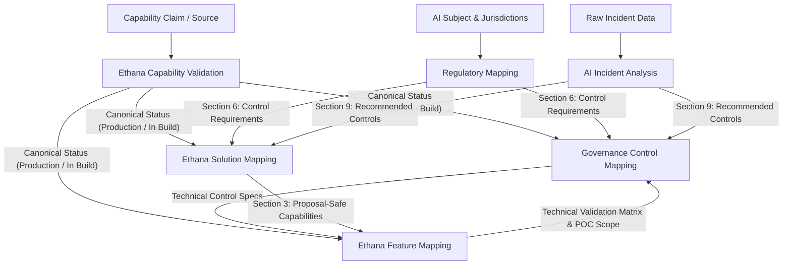

# Governance OS — Repository Skill Dependency Graph

**Date of Assessment:** 2026-06-17  
**Repository State:** 6 active skills, 0 agents (central), 0 workflows (central), 0 evaluations (central)  
**Scope:** Architecture assessment and dependency mapping.  

---

## 1. Skill Dependency Graph

The following Mermaid diagram visualizes the flow of governance metadata, regulatory obligations, capability assertions, and technical controls across the six active skills.

---

## 2. Skill Inventory & Dependency Map

### 2.1 AI Incident Analysis
- **Purpose:** Analyzes AI incidents (security, model failures, agency breaches) and produces a 10-section report detailing root causes, control failures, and frameworks.
- **Inputs:**
  - `incident_description` (Required)
  - `incident_type` (Required)
  - `organisation_context` / `affected_system` / `client_context` (Optional)
- **Outputs:** Root cause analysis, control failure categorization, regulatory implications, and recommended controls.
- **Knowledge Dependencies:**
  - `knowledge/frameworks/` (ISO 42001, NIST AI RMF, OWASP LLM Top 10)
  - `knowledge/regulations/` (EU AI Act, UK AI Guidance, India AI Landscape)
  - `knowledge/controls/` (Prompt injection, agent governance, etc.)
  - `knowledge/ai-incidents/` (Precedent incident data)
- **Upstream Skills:** None (accepts raw incident data).
- **Downstream Skills:**
  - [governance-control-mapping](file:///Users/ajayrajsingh/Documents/governance-os/skills/governance-control-mapping/) (consumes recommended controls to design operational specifications).
  - [ethana-solution-mapping](file:///Users/ajayrajsingh/Documents/governance-os/skills/ethana-solution-mapping/) (uses recommended controls to map commercial solutions).

### 2.2 Regulatory Mapping
- **Purpose:** Maps AI use cases, systems, or controls to global regulatory frameworks (EU, UK, India) to output obligations and classifications.
- **Inputs:**
  - `subject_description` (Required)
  - `subject_type` (Required)
  - `jurisdictions` (Required)
  - `industry` / `data_types` / `ai_technology` (Optional)
- **Outputs:** Applicable regulations, framework clauses, regulatory obligations, documentation requirements, and control requirements.
- **Knowledge Dependencies:**
  - `knowledge/frameworks/` (ISO 42001, NIST AI RMF, OWASP LLM Top 10)
  - `knowledge/regulations/` (EU AI Act, UK AI Guidance, India AI Landscape)
  - `knowledge/ethana/canonical-product-model.md` (Primary Ethana authority)
  - `knowledge/ethana/framework-crosswalk.md` (Framework mapping cross-check)
- **Upstream Skills:** None (accepts raw subject data).
- **Downstream Skills:**
  - [governance-control-mapping](file:///Users/ajayrajsingh/Documents/governance-os/skills/governance-control-mapping/) (translates regulatory control requirements into implementation designs).
  - [ethana-solution-mapping](file:///Users/ajayrajsingh/Documents/governance-os/skills/ethana-solution-mapping/) (maps regulatory controls to proposal-safe platform features).

### 2.3 Ethana Capability Validation
- **Purpose:** Verifies whether a specific capability claim is valid against Cursory's canonical engineering state.
- **Inputs:**
  - `capability_name` / `proposed_claim` / `source_document` (At least one required)
  - `claim_context` / `jurisdiction` (Optional)
- **Outputs:** Validated status (Production, In Build, Aspirational), Evidence Confidence Score (ECS), and Claim Permission Level (CPL).
- **Knowledge Dependencies:**
  - `knowledge/ethana/canonical-product-model.md` (Sole authority source)
  - `knowledge/ethana/primary-source-validation.md` (Underlying engineering briefs)
- **Upstream Skills:** None (foundational truth-gate skill).
- **Downstream Skills:**
  - [governance-control-mapping](file:///Users/ajayrajsingh/Documents/governance-os/skills/governance-control-mapping/) (governs technical configuration choices).
  - [ethana-solution-mapping](file:///Users/ajayrajsingh/Documents/governance-os/skills/ethana-solution-mapping/) (controls commercial proposal language).
  - [ethana-feature-mapping](file:///Users/ajayrajsingh/Documents/governance-os/skills/ethana-feature-mapping/) (governs sandbox proof-of-concept scopes).

### 2.4 Ethana Solution Mapping
- **Purpose:** Maps control requirements to commercial platform capabilities and assigns Coverage Confidence Scores (CCS).
- **Inputs:**
  - `requirement_list` / `customer_use_case` (At least one required)
  - `customer_sector` / `jurisdictions` / `deployment_constraint` (Optional)
- **Outputs:** Requirement coverage map, proposal-safe language, and commercial motion recommendations.
- **Knowledge Dependencies:**
  - `knowledge/ethana/canonical-product-model.md` (Sole authority source)
  - `knowledge/ethana/competitor-positioning.md` (Competitive matrix)
- **Upstream Skills:**
  - [regulatory-mapping](file:///Users/ajayrajsingh/Documents/governance-os/skills/regulatory-mapping/) (provides Section 6 control needs).
  - [ai-incident-analysis](file:///Users/ajayrajsingh/Documents/governance-os/skills/ai-incident-analysis/) (provides Section 9 recommended controls).
  - [ethana-capability-validation](file:///Users/ajayrajsingh/Documents/governance-os/skills/ethana-capability-validation/) (validates specific capability claims).
- **Downstream Skills:**
  - [ethana-feature-mapping](file:///Users/ajayrajsingh/Documents/governance-os/skills/ethana-feature-mapping/) (validates technical feasibility of proposal capabilities).
  - [governance-control-mapping](file:///Users/ajayrajsingh/Documents/governance-os/skills/governance-control-mapping/) (designs process controls to support platform features).

### 2.5 Ethana Feature Mapping
- **Purpose:** Validates technical feasibility and API integration paths for proposed features in a customer's environment.
- **Inputs:**
  - `feature_question` / `poc_scope` (Required)
  - `integration_endpoint` / `deployment_constraint` (Optional)
- **Outputs:** Technical validation map, Technical Fit Score (TFS), and recommended sandbox configuration.
- **Knowledge Dependencies:**
  - `knowledge/ethana/canonical-product-model.md` (Sole authority source)
  - `knowledge/ethana/product-architecture-investigation.md` (API/architecture details)
- **Upstream Skills:**
  - [ethana-solution-mapping](file:///Users/ajayrajsingh/Documents/governance-os/skills/ethana-solution-mapping/) (provides proposed capabilities).
  - [ethana-capability-validation](file:///Users/ajayrajsingh/Documents/governance-os/skills/ethana-capability-validation/) (validates feature status).
- **Downstream Skills:**
  - [governance-control-mapping](file:///Users/ajayrajsingh/Documents/governance-os/skills/governance-control-mapping/) (defines operational procedures and audit logs for verified features).

### 2.6 Governance Control Mapping
- **Purpose:** Translates high-level control requirements and features into operational preventive, detective, and corrective specifications.
- **Inputs:**
  - `upstream_source_type` (Required)
  - `upstream_payload` (Required)
  - `target_maturity_level` (Required)
  - `jurisdictions` / `client_sector` / `existing_tooling` (Optional)
- **Outputs:** Control matrix, Control Coverage Classification, control specifications, RACI, and evidence criteria.
- **Knowledge Dependencies:**
  - `knowledge/controls/*` (Data protection, model risk, audit, prompt injection, agent)
  - `knowledge/ethana/canonical-product-model.md` (Sole authority source)
  - `knowledge/frameworks/*` (ISO 42001, NIST AI RMF, OWASP LLM)
- **Upstream Skills:**
  - [regulatory-mapping](file:///Users/ajayrajsingh/Documents/governance-os/skills/regulatory-mapping/) (provides Section 6 control needs).
  - [ai-incident-analysis](file:///Users/ajayrajsingh/Documents/governance-os/skills/ai-incident-analysis/) (provides Section 9 recommended controls).
  - [ethana-feature-mapping](file:///Users/ajayrajsingh/Documents/governance-os/skills/ethana-feature-mapping/) (verifies feature feasibility before detailing specifications).
  - [ethana-capability-validation](file:///Users/ajayrajsingh/Documents/governance-os/skills/ethana-capability-validation/) (governs permitted configuration states).
- **Downstream Skills:** None (this is the final operationalization gate).

---

## 3. Gap Analysis: Missing Central Workflows & Evaluations

### 3.1 Missing Workflow Definitions (Empty `workflows/`)
Each individual skill contains a local `workflow.md` describing how a human or subagent executes that *specific* skill. However, the root `workflows/` directory remains empty. 

**Gaps identified:**
- **Executable Orchestration Specifications:** No formal definitions (e.g., YAML/JSON schemas or Python configurations) exist to define the pipelines connecting upstream outputs to downstream inputs.
- **Input/Output Translation Schemas:** There are no automated parser definitions to extract Section 6 from `regulatory-mapping` and package it as the input payload for `governance-control-mapping`.
- **Roadmap:** High-priority workflow configuration templates need to be created in `workflows/`:
  - `workflows/discovery-to-proposal.yaml`: Chains `Regulatory Mapping` → `Governance Control Mapping` → `Solution Mapping` → `Feature Mapping`.
  - `workflows/incident-remediation.yaml`: Chains `AI Incident Analysis` → `Governance Control Mapping` → `Feature Mapping`.

### 3.2 Missing Evaluation Coverage (Empty `evaluations/`)
While each skill folder contains an `evaluation.md` detailing rubrics and local thresholds (e.g., CPL, TFS, CCS), the root `evaluations/` directory is empty.

**Gaps identified:**
- **Cross-Skill Regression Testing:** There is no automated framework to run test payloads across the entire chain and assert that the **Claims Firewall** was respected globally.
- **Harmonized Scoring Standards:** There is no centralized logger to compile individual skill evaluations (e.g., ECS, TFS) into a unified "Client Governance Scorecard."
- **Roadmap:** High-priority test suites and templates should be created in `evaluations/`:
  - `evaluations/test-suites/`: Collections of mock customer RFPs, regulations, and incident reports.
  - `evaluations/claims-firewall-linter.py`: An automated script to parse all downstream output sections and search for unauthorized terms or unconfirmed feature configurations (e.g., checking if "Visual Agent Builder" is labeled as Production).

---

## 4. Candidate Orchestration Agents

The `agents/` directory is empty. With the addition of the `governance-control-mapping` skill, the readiness of candidate orchestration agents has changed significantly.

| Agent | Skills Orchestrated | Trigger | Output | Readiness Status |
|---|---|---|---|---|
| **Incident Intelligence Agent** | `AI Incident Analysis` → `Governance Control Mapping` | New public or internal AI incident report detected. | A complete remediation package detailing root causes, control taxonomy, and Ethana configuration adjustments. | **Ready.** All required skills are fully implemented. |
| **Regulatory Watch Agent** | `Regulatory Mapping` → `Governance Control Mapping` | Updates to regulatory guidelines or new enforcement actions in scope. | Updated client compliance profiles and adjusted technical/process control designs. | **Ready.** All required skills are fully implemented. |
| **Capability Validation Agent** | `Ethana Capability Validation` | Commits or updates to `knowledge/ethana/canonical-product-model.md`. | Automated regression check of all active commercial solution maps, raising flags on newly deprecated or elevated features. | **Ready.** All required skills are fully implemented. |
| **Client Assessment Agent** | `Regulatory Mapping` → `ISO 42001 Gap Assessment` → `Governance Control Mapping` → `Ethana Solution Mapping` | Periodic audit schedule or new client onboarding. | Comprehensive governance program audit, framework compliance gap analysis, operational control design, and solution proposals. | **Blocked.** Requires the creation of the planned `ISO 42001 Gap Assessment` skill. *(Previously blocked on control-mapping as well).* |
| **Ethana Proposal Agent** | `Regulatory Mapping` → `Governance Control Mapping` → `Ethana Solution Mapping` → `Ethana Feature Mapping` → `Proposal Review` | Customer RFP received or discovery call logged. | Completed, technically validated, and claims-compliant customer proposal package. | **Blocked.** Requires the creation of the planned `Proposal Review` skill. |
