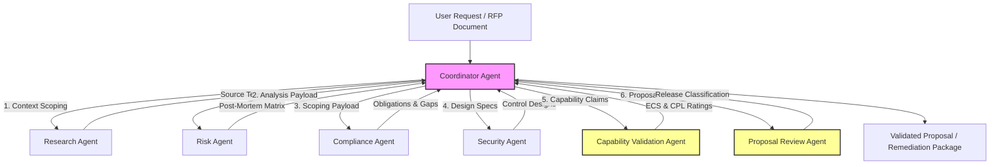

# Governance OS — Anthropic Managed Agents Audit

**Date of Audit:** 2026-06-17  
**Auditor:** Anthropic Managed Agents Architect (Antigravity AI)  
**Workspace:** `governance-os` ([/Users/ajayrajsingh/Documents/governance-os](file:///Users/ajayrajsingh/Documents/governance-os))  
**Scope:** Evaluation of Skill and Tool boundaries, Progressive Disclosure patterns, Multi-Agent orchestration, and MCP integration readiness.

---

## 1. Executive Summary

This audit evaluates the Governance OS repository against Anthropic's **Managed Agents** and **Model Context Protocol (MCP)** architectural standards. 

Currently, Governance OS has a well-parameterized, structured skill layer that serves as a logical foundation. However, the repository lacks the execution wrapper: the `agents/` folder is empty, and workflows exist only as documentation. To achieve production readiness, the repository must transition from static execution guidelines to an autonomous multi-agent mesh coordinated by a central router agent, using MCP tool abstractions for file, database, and verification operations.

**Maturity Classification: Multi-Agent Ready (Conceptual Stage)**  
**Readiness Score: 45 / 100**

---

## 2. Recommended Agent Topology

The diagram below visualizes the target orchestration flow, showcasing how the central Coordinator Agent progressively discloses payloads to specialist agents, enforcing the Claims Firewall and verification gates.



---

## 3. Recommended Agent Structure

To operationalize the topology, we recommend implementing the following seven managed agents under the [agents/](file:///Users/ajayrajsingh/Documents/governance-os/agents) directory:

### 3.1 Coordinator Agent
*   **Role:** Central router, task triager, and context manager.
*   **System Prompt:** *You are the Coordinator Agent for Governance OS. Your role is to ingest user prompts, construct the execution DAG, delegate tasks to specialized subagents, manage progressive context disclosure, and enforce quality gate thresholds between skill execution steps.*
*   **Tools:** `list_directory`, `workflow_validator_tool`, `agent_certifier_tool`.
*   **Decoupling Strategy:** Maintains the execution state, resolving circular dependencies by sequentially passing control design requirements to the Security Agent and feeding technical fit outputs to the Compliance Agent for final review.

### 3.2 Research Agent
*   **Role:** Context validator and knowledge-base searcher.
*   **System Prompt:** *You are the Research Agent. Your role is to search the knowledge base directories, extract regulatory text and incident details, and summarize client-specific documents without making policy or control design decisions.*
*   **Tools:** `knowledge_semantic_search_tool`, `read_file`.

### 3.3 Risk Agent
*   **Role:** AI Incident and failure analyst.
*   **System Prompt:** *You are the Risk Agent. Your role is to ingest raw incident logs, execute the AI Incident Analysis skill, analyze root causes using 5-Whys methodology, and map failures to framework control categories.*
*   **Orchestrated Skill:** `skills/ai-incident-analysis/`
*   **Tools:** `read_file`, `write_incident_analysis_tool`.

### 3.4 Compliance Agent
*   **Role:** Regulatory classifier and gap assessor.
*   **System Prompt:** *You are the Compliance Agent. Your role is to ingest AI use cases and target jurisdictions, execute the Regulatory Mapping and ISO 42001 Gap Assessment skills, determine regulatory tiers (such as EU High Risk), and output compliance obligations.*
*   **Orchestrated Skills:** `skills/regulatory-mapping/`, `skills/iso-42001-gap-assessment/` (Planned).
*   **Tools:** `read_file`, `write_regulatory_mapping_tool`.

### 3.5 Security Agent
*   **Role:** Control designer and technical fit scoping agent.
*   **System Prompt:** *You are the Security Agent. Your role is to translate compliance obligations and incident findings into operational control specifications, verify Ethana feature readiness against the technical environment, and output preventive, detective, and corrective controls.*
*   **Orchestrated Skills:** `skills/governance-control-mapping/`, `skills/ethana-feature-mapping/`.
*   **Tools:** `read_file`, `write_control_specification_tool`, `verify_feature_compatibility_tool`.

### 3.6 Capability Validation Agent
*   **Role:** Product truth-gate and claims firewall validator.
*   **System Prompt:** *You are the Capability Validation Agent. Your role is to evaluate specific commercial claims against Cursory's canonical engineering states, check for prohibited sources, compute Evidence Confidence Scores (ECS), and assign Claim Permission Levels (CPL).*
*   **Orchestrated Skill:** `skills/ethana-capability-validation/`
*   **Tools:** `claims_linter_tool`, `read_canonical_product_model_tool`.

### 3.7 Proposal Review Agent
*   **Role:** Final release gate and proposal auditor.
*   **System Prompt:** *You are the Proposal Review Agent. Your role is to ingest draft proposal documents, verify that all capabilities map to validated production features, check for claims firewall compliance, and output the final Release Classification.*
*   **Orchestrated Skill:** `skills/proposal-review/` (Planned).
*   **Tools:** `claims_linter_tool`, `regression_tester_tool`.

---

## 4. Skills vs. Agents Classification

To maintain Anthropic's efficiency guidelines, we classify repository operations into **Agents** (which require planning, multi-step tool use, and cognitive execution) and **Skills** (parameterized, deterministic tasks that can be wrapped as tools called by agents).

| Operation / Capability | Classification | Rationale |
| :--- | :---: | :--- |
| **AI Incident Analysis** | **Agent-Led** | Requires cognitive root-cause reasoning and narrative generation. |
| **Regulatory Mapping** | **Agent-Led** | Involves jurisdictional matching and multi-factor classification. |
| **Ethana Capability Validation** | **Agent-Led** | Requires evidence adjudication and claim permission decision-making. |
| **Ethana Solution Mapping** | **Agent-Led** | Combines commercial scoping and proposal narrative creation. |
| **Ethana Feature Mapping** | **Agent-Led** | Involves technical constraint mapping and POC test design. |
| **Governance Control Mapping** | **Agent-Led** | Requires complex specification design and RACI allocation. |
| **Claims Firewall Linting** | **Skill (Tool)** | Deterministic regex/text scanning checks against a schema. |
| **Structural Regression Check** | **Skill (Tool)** | Deterministic verification of markdown headings and tables. |
| **Payload Schema Validation** | **Skill (Tool)** | Zero-dependency JSON schema parsing. |
| **Scorecard Compilation** | **Skill (Tool)** | Mathematical aggregation of local skill metrics. |
| **ISO 42001 Gap Assessment** | **Skill (Tool)** | Crosswalk mapping and maturity matrix scoring. |

---

## 5. Architectural Evaluation & Gap Analysis

### 5.1 Skill and Tool Boundary Gaps
*   **No MCP Tool Schemas:** The skills are parameterised conceptually, but they are not exposed as JSON schemas matching the Model Context Protocol. Anthropic agents cannot automatically invoke them because there are no schema wrappers (e.g., `schema.json` in each skill folder defining tool arguments).
*   **Lack of Read/Write Sandboxing:** Specialist agents require read-only access to the knowledge base but write access only to their specific draft outputs. These directory boundaries are not enforced at the file system or tool proxy level.

### 5.2 Coordinator & Routing Gaps
*   **State Machine Absence:** There is no centralized workflow manager. Payloads are passed ad-hoc, which blocks progressive disclosure (e.g., the Compliance Agent should not see the competitor pricing model, but currently, both reside in the same flat folder).
*   **Human-in-the-Loop Interrupter Missing:** For high-stakes actions (such as publishing a proposal or classifying a CPL-5 claim), Anthropic agents require a prompt gate that pauses execution and awaits human input. No such gate mechanism is implemented.

### 5.3 Multi-Agent Workflow Gaps
*   **No Decoupled DAG Pipelines:** The circular loop between Control Mapping (`GCM`) and Feature Mapping (`EFM`) has no intermediate queue. If implemented directly, the agents will loop indefinitely.

---

## 6. Readiness Score Breakdown

| Dimension | Score | Assessment | Gaps to Resolve |
| :--- | :---: | :--- | :--- |
| **1. Skill & Tool Design** | **12 / 20** | Semi-Mature | parameterized markdown exists; MCP JSON tool schemas are missing. |
| **2. Agent Boundaries & Isolation** | **8 / 20** | Immature | Conceptual boundaries documented; directory-level tool permissions are missing. |
| **3. Coordinator & Orchestration** | **2 / 20** | Immature | Coordinator logic is missing; no state machine or DAG runner. |
| **4. Multi-Agent Integration** | **13 / 20** | Semi-Mature | Input/output JSON schemas are complete, enabling smooth data serialization. |
| **5. Evaluation & Lifecycle** | **10 / 20** | Semi-Mature | Linter, regression tester, and certifier scripts are implemented. |
| **Total Score** | **45 / 100** | **Conceptual Multi-Agent State** | **Focus:** Wrap skills as tools, decouple circular loops, and code the Coordinator Agent. |

---

## 7. Implementation Roadmap

```
Phase 1: Toolification (Weeks 1-2)
  ├── 1. Author JSON schemas for all 6 skills under workflows/schemas/tool-specs/
  ├── 2. Implement MCP server exposing evaluations/scripts as executable tools
  └── 3. Create capability_validation_output.json schema in workflows/schemas/

Phase 2: Decoupling & Coordinator Build (Weeks 3-4)
  ├── 1. Refactor GCM $\rightarrow$ EFM boundary, routing EFM technical outputs to a validation queue
  ├── 2. Implement coordinator_agent.py managing state transitions and payload validation
  └── 3. Implement the Human-in-the-loop (HITL) prompt-gate in coordinator_agent.py

Phase 3: Specialist Agent Generation (Weeks 5-6)
  ├── 1. Implement specialist agent templates under agents/ specialist folders
  ├── 2. Configure read/write tool directories per agent (enforcing Progressive Disclosure)
  └── 3. Implement the missing ISO 42001 Gap Assessment and Proposal Review skills

Phase 4: Multi-Agent Validation Sweep (Week 7)
  ├── 1. Populate evaluations/test-cases/ with mock RFPs and regulatory profiles
  └── 2. Run end-to-end regression tests to verify that the Coordinator enforces the claims firewall
```
