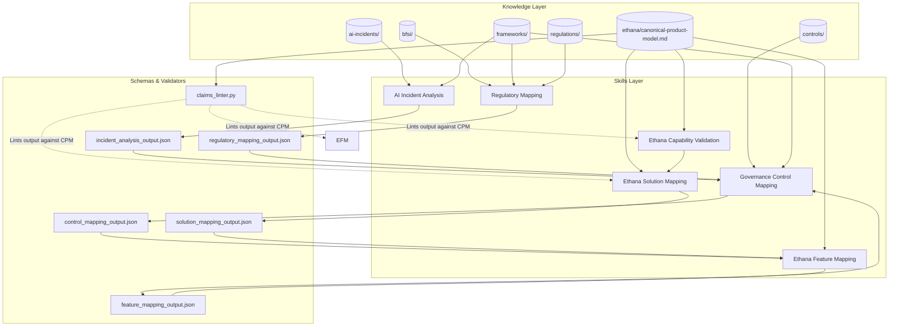
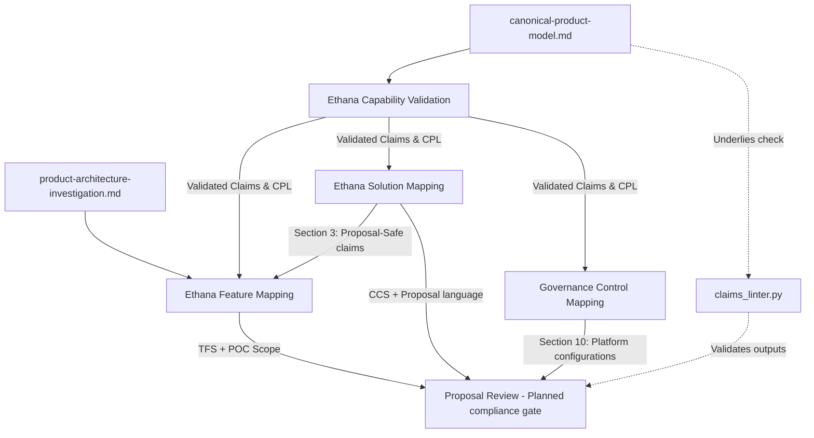

# Governance OS — Repository Architecture Audit

**Date of Audit:** 2026-06-17  
**Auditor:** Independent Repository Architect (Antigravity AI)  
**Workspace:** `governance-os` ([/Users/ajayrajsingh/Documents/governance-os](file:///Users/ajayrajsingh/Documents/governance-os))  
**Scope:** Knowledge, Skills, Workflows, Evaluations, Truth Layer, Agent Readiness, and Data Flow Design.

---

## 1. Overall Architecture Score: 63 / 100

Governance OS possesses a highly rigorous, mature conceptual layer for advisory services (Knowledge and parameterized Skills). However, the repository suffers from architectural bottlenecks at the implementation and automation layers. It sits in a transitional **Operationalized-Advisory** stage: the logical relationships are documented, but there is an absence of executable orchestrations, incomplete evaluation baselines, empty agent frameworks, and minor circular logic loops that block autonomous execution.

### Score Breakdown by Dimension

| Dimension | Score | Assessment | Key Strengths & Gaps |
| :--- | :---: | :--- | :--- |
| **1. Knowledge Architecture** | **18 / 25** | Semi-Mature | **Strengths:** Excellent mapping of AI incidents, global regulations, and controls. **Gaps:** High volume of redundant files in `source-material/`, duplicate competitor positioning battle-cards, and prohibited Tier 4 files active in the workspace. |
| **2. Skills Architecture** | **16 / 25** | Semi-Mature | **Strengths:** 6 active skills are fully structured with rubrics, examples, and inputs/outputs. **Gaps:** 5 phantom skills referenced in documentation but not implemented, plus a circular dependency between Control Mapping and Feature Mapping. |
| **3. Workflow Architecture** | **10 / 25** | Immature | **Strengths:** Conceptual sequences and shared components (`comp.truth_gate`) are well-designed. **Gaps:** Workflows exist solely as static Markdown guidelines. There are no executable JSON/YAML orchestrations or Python DAG runners. |
| **4. Evaluation Architecture** | **8 / 25** | Immature | **Strengths:** Structured validation scripts (`claims_linter.py`, `workflow_validator.py`, etc.) exist. **Gaps:** Structural baselines are missing for 4 of the 6 skills, test-cases database is empty, and `scorecard_compiler.py` is a placeholder. |
| **5. Truth Layer & Agent Readiness** | **11 / 25** | Immature | **Strengths:** Single source of status authority (`canonical-product-model.md`) is enforced. **Gaps:** The `agents/` folder is empty. All planned agents have zero active codebase, and `agent_certifier.py` checks only file presence, not functionality. |
| **Total Score** | **63 / 100** | **Operationalized-Advisory** | **Critical Next Focus:** Eliminate duplicate assets, resolve circular dependency, generate missing baselines, and transition workflows to executable configurations. |

---

## 2. Top 20 Findings

### 2.1 Critical Findings (Blockers to automation or major logical issues)

1.  **Circular Dependency between Control Mapping and Feature Mapping**  
    *Classification:* **Critical**  
    *Detail:* `Governance Control Mapping` ([SKILL.md](file:///Users/ajayrajsingh/Documents/governance-os/skills/governance-control-mapping/SKILL.md#L184)) lists `Ethana Feature Mapping` as downstream. Conversely, `Ethana Feature Mapping` ([SKILL.md](file:///Users/ajayrajsingh/Documents/governance-os/skills/ethana-feature-mapping/SKILL.md#L293)) lists `Governance Control Mapping` as downstream. This creates a logical dead-lock where control specifications need feature verification, but feature validation relies on detailed control specs.
2.  **No Executable Orchestration Code in `workflows/`**  
    *Classification:* **Critical**  
    *Detail:* The [workflows/](file:///Users/ajayrajsingh/Documents/governance-os/workflows/) directory contains conceptual Markdown files only. There are no YAML pipelines, JSON configs, or Python DAGs to programmatically route payloads between skills.
3.  **Complete Absence of Agent Codebase**  
    *Classification:* **Critical**  
    *Detail:* The [agents/](file:///Users/ajayrajsingh/Documents/governance-os/agents/) directory is entirely empty. All planned agents (Incident, Regulatory, Capability, Client, and Proposal) are conceptual and lack operational code.
4.  **Prohibited Tier 4 Files Active in Knowledge Base**  
    *Classification:* **Critical**  
    *Detail:* Superseded historical files (`capability-status.md`, `source-of-truth.md`, `ethana-status-reconciliation.md`) remain active in `knowledge/ethana/`. These files contain outdated product statuses and lack the mandatory caveats present in the canonical model, posing a high risk of operator error.

### 2.2 Major Findings (High impact on validation or operational integrity)

5.  **Missing Structural Baselines in `evaluations/baselines/`**  
    *Classification:* **Major**  
    *Detail:* Structural baseline JSON files exist only for `regulatory-mapping` and `governance-control-mapping`. The remaining four skills (`ai-incident-analysis`, `ethana-capability-validation`, `ethana-solution-mapping`, `ethana-feature-mapping`) have no baselines. This prevents `regression_tester.py` from verifying them.
6.  **Certification False Positives in `agent_certifier.py`**  
    *Classification:* **Major**  
    *Detail:* Status reports claim the *Incident Intelligence Agent* is at Level 3 (Evaluations Passing). However, running `agent_certifier.py` dynamically returns Level 2 (Missing baselines) because no structural baseline folder exists for `ai-incident-analysis`.
7.  **`scorecard_compiler.py` is a Script Placeholder**  
    *Classification:* **Major**  
    *Detail:* The script [scorecard_compiler.py](file:///Users/ajayrajsingh/Documents/governance-os/evaluations/scripts/scorecard_compiler.py) contains only a placeholder exit routine. There is no automated capability to parse local skill metrics and compile a client scorecard.
8.  **Five Phantom Skills Referenced in Documentation**  
    *Classification:* **Major**  
    *Detail:* Five skills (`risk-assessment`, `framework-gap-analysis`, `regulatory-exposure`, `iso-42001-gap-assessment`, and `proposal-review`) are declared as dependencies in other files but do not exist in the repository.
9.  **Missing Inter-Skill Schema for Capability Validation**  
    *Classification:* **Major**  
    *Detail:* `workflows/schemas/` contains schemas for the output of 5 skills, but is missing one for `ethana-capability-validation`. Since this skill is a critical upstream gate for the Ethana chain, its output format is unvalidated.
10. **Empty Test Case Database**  
    *Classification:* **Major**  
    *Detail:* [evaluations/test-cases/](file:///Users/ajayrajsingh/Documents/governance-os/evaluations/test-cases/) contains only a readme. No mock input payloads (incident reports, client RFPs, use cases) are present to run automated regression sweeps.
11. **Duplicate Competitor Positioning Files**  
    *Classification:* **Major**  
    *Detail:* `knowledge/ethana/` contains two competitive documents: [competitor-positioning.md](file:///Users/ajayrajsingh/Documents/governance-os/knowledge/ethana/competitor-positioning.md) (Detailed product-level battle-cards, 8.6 KB) and [competitive-positioning.md](file:///Users/ajayrajsingh/Documents/governance-os/knowledge/ethana/competitive-positioning.md) (High-level battle-cards summary, 2.8 KB) with overlapping content.
12. **Mass Duplication of Assets in `source-material/`**  
    *Classification:* **Major**  
    *Detail:* The [source-material/](file:///Users/ajayrajsingh/Documents/governance-os/source-material/) folder contains flat copies of markdown files matching active files in `knowledge/ethana/` (such as `ai-gateway.md`, `mcp-security.md`, etc.), complicating source control.

### 2.3 Minor Findings (Low operational impact, documentation drifts)

13. **Outdated Reference in Regulatory Mapping**  
    *Classification:* **Minor**  
    *Detail:* [regulatory-mapping/SKILL.md line 215](file:///Users/ajayrajsingh/Documents/governance-os/skills/regulatory-mapping/SKILL.md#L215) lists `skills/governance-control-mapping/` as `(planned)`, though it has been fully implemented.
14. **Knowledge File Location Mismatch**  
    *Classification:* **Minor**  
    *Detail:* [knowledge/ethana/README.md](file:///Users/ajayrajsingh/Documents/governance-os/knowledge/ethana/README.md) details a nested directory structure (`ethana-platform/`, `cursory-services/`, `capabilities/`), but the actual directory contains a flat structure.
15. **Ad-hoc Local Runtime Directory**  
    *Classification:* **Minor**  
    *Detail:* The folder `knowledge/ethana/mnt/` holds local test logs and user outputs, creating untracked file footprint in the knowledge base.
16. **Unreconciled Status Flags in Reference Files**  
    *Classification:* **Minor**  
    *Detail:* The reference file [framework-crosswalk.md](file:///Users/ajayrajsingh/Documents/governance-os/knowledge/ethana/framework-crosswalk.md) maps capabilities to frameworks using status tags (`[P]`, `[IB]`, `[RM]`) that are not reconciled with the canonical model.
17. **Certifier Only Performs Static Verification**  
    *Classification:* **Minor**  
    *Detail:* `agent_certifier.py` calculates readiness scores purely by checking if folders and files exist on disk, rather than asserting test coverage or validating schema conformance.

### 2.4 Observations (Contextual feedback and expansion gaps)

18. **Functional Overlap in Framework Mapping**  
    *Classification:* **Observation**  
    *Detail:* Framework mapping is executed by both `AI Incident Analysis` (Section 5) and `Regulatory Mapping` (Section 2). This is acceptable as incident mapping registers *what went wrong* and regulatory mapping evaluates *what must be done*, but parsing functions overlap.
19. **Missing US Regulatory Profiles and Threat Taxonomies**  
    *Classification:* **Observation**  
    *Detail:* The knowledge layer lacks profiles for US regulations (Executive Order 14110, Colorado SB 24-205) and security threat models like MITRE ATLAS, both of which are referenced in future roadmaps.
20. **Commercial and Advisory Contexts Merged**  
    *Classification:* **Observation**  
    *Detail:* Sales strategies, demo scripts, and objection handlers sit in the same `knowledge/ethana/` folder as technical model details, making it difficult to isolate compliance-only references.

---

## 3. Top 10 Risks

1.  **Dead-locks in Automated Workflows (Severity: Critical | Likelihood: High)**  
    The circular dependency between `GCM` and `EFM` will cause infinite loops or deadlocks in automated runners unless an explicit human step or decoupling interface is established.
2.  **Claims Firewall Violations (Severity: Critical | Likelihood: Medium)**  
    The presence of prohibited Tier 4 files (`capability-status.md`, etc.) allows developers or operators to cite deprecated production statuses, causing unintended firewall breaches.
3.  **Silent Failures in Non-validated Skills (Severity: Major | Likelihood: High)**  
    Because structural baselines are missing for 4 of the skills, changes to these files can introduce format drift without triggering a failure in `regression_tester.py`.
4.  **Run-time Schema Mismatch (Severity: Major | Likelihood: Medium)**  
    The lack of an output schema for `ethana-capability-validation` means downstream inputs could ingest malformed status structures without a parser alert.
5.  **Phantom Skill Dependency Crashes (Severity: Major | Likelihood: Low)**  
    If an orchestration engine attempts to call the planned workflows, it will crash immediately upon invoking the missing `iso-42001-gap-assessment` or `proposal-review` skills.
6.  **False Readiness Claims (Severity: Major | Likelihood: Low)**  
    The certifier tool's directory-walk logic means an agent could be marked as Level 3 "Ready" even if its underlying skill scripts contain runtime syntax errors.
7.  **Loss of Traceability in Scorecards (Severity: Medium | Likelihood: High)**  
    The placeholder status of `scorecard_compiler.py` forces humans to manually extract and aggregate metrics, increasing scoring errors in client briefings.
8.  **Source Control Pollution (Severity: Medium | Likelihood: High)**  
    The massive duplication of files between `source-material/` and `knowledge/ethana/` increases git index bloat and risk of conflicting file updates.
9.  **US Regulatory Compliance Gap (Severity: Medium | Likelihood: Medium)**  
    Enterprise clients deploying in US regions cannot evaluate compliance due to the lack of Colorado AI Act and US Federal EO files in `knowledge/regulations/`.
10. **API Proxy Over-claim (Severity: Low | Likelihood: Medium)**  
    Lack of REST API proxy validation in `product-architecture-investigation.md` may lead feature mappings to over-claim non-LLM Rest coverage.

---

## 4. Top 10 Recommendations

1.  **Decouple the GCM $\leftrightarrow$ EFM Circular Loop (Priority: Critical)**  
    Refactor the skills so `GCM` takes only high-level requirements as input, outputs control specs, and feeds them to `EFM`. `EFM` evaluates technical fit and outputs the POC feasibility matrix. Decouple the return path by having a separate compliance review step rather than a circular dependency.
2.  **Remove Prohibited Tier 4 Knowledge Files (Priority: Critical)**  
    Delete `capability-status.md`, `source-of-truth.md`, and `ethana-status-reconciliation.md` from `knowledge/ethana/` to prevent claims firewall contamination.
3.  **Generate Baselines for the Remaining 4 Skills (Priority: Major)**  
    Write structural baselines under `evaluations/baselines/` for `ai-incident-analysis`, `ethana-capability-validation`, `ethana-solution-mapping`, and `ethana-feature-mapping`.
4.  **Create Capability Validation JSON Schema (Priority: Major)**  
    Add `capability_validation_output.json` to `workflows/schemas/` to enforce type-safety for CPL and ECS outputs.
5.  **Implement the Missing `iso-42001-gap-assessment` Skill (Priority: Major)**  
    Generate the standard 4-file structure for this skill to unblock the Client Assessment Agent path.
6.  **Implement the `proposal-review` (or `ethana-proposal-review`) Skill (Priority: Major)**  
    Create this skill to establish the final release compliance gate for commercial proposals.
7.  **Clean up the `source-material/` Duplications (Priority: Major)**  
    Remove duplicate flat markdown files from `source-material/` and track Excel/Word binaries under a distinct `source-material/archive/` folder.
8.  **Resolve the Competitor Positioning Duplication (Priority: Major)**  
    Consolidate `competitive-positioning.md` and `competitor-positioning.md` into a single file named `competitor-positioning.md` containing both executive and product-level sections.
9.  **Transition Workflows to JSON/YAML Declarations (Priority: Major)**  
    Create executable workflow definitions (e.g., in a workflows/engine/ directory or using a Python runner) that load JSON schemas and execute steps sequentially.
10. **Build Out the Test Case Database (Priority: Major)**  
    Populate `evaluations/test-cases/` with mock payloads representing varying regulatory and incident scenarios to verify linter and tester coverage.

---

## 5. Dependency Diagrams and Maps

### 5.1 General Dependency Graph
The diagram below maps how knowledge files, schemas, and skills interact across the repository layers.

---

### 5.2 Skill $\rightarrow$ Workflow $\rightarrow$ Evaluation Mapping

This map traces how each implemented skill is orchestrated via workflows and verified by evaluation scripts.

| Skill | Orchestrating Workflow | Verified By (Script + Baseline / Schema) | Pass Threshold / Action |
| :--- | :--- | :--- | :--- |
| **AI Incident Analysis** | `incident-assessment-workflow.md` | `workflow_validator.py` + `incident_analysis_output.json` *Note: Missing regression baseline.* | 70/100 Appends to database |
| **Regulatory Mapping** | `regulatory-compliance-workflow.md` `governance-assessment-workflow.md` `proposal-development-workflow.md` | `workflow_validator.py` + `regulatory_mapping_output.json` `regression_tester.py` + `regulatory-mapping/structure.json` | 70/100 Generates obligations |
| **Ethana Capability Validation** | `ethana-solution-design-workflow.md` `governance-assessment-workflow.md` `incident-assessment-workflow.md` | `claims_linter.py` + `canonical-product-model.md` *Note: Missing output schema and structural baseline.* | 90/100 Assigns CPL / ECS |
| **Ethana Solution Mapping** | `regulatory-compliance-workflow.md` `ethana-solution-design-workflow.md` `proposal-development-workflow.md` | `workflow_validator.py` + `solution_mapping_output.json` `claims_linter.py` + `canonical-product-model.md` *Note: Missing regression baseline.* | 70/100 Calculates CCS |
| **Ethana Feature Mapping** | `ethana-solution-design-workflow.md` `proposal-development-workflow.md` | `workflow_validator.py` + `feature_mapping_output.json` `claims_linter.py` + `canonical-product-model.md` *Note: Missing regression baseline.* | 85/100 Calculates TFS |
| **Governance Control Mapping** | `incident-assessment-workflow.md` `regulatory-compliance-workflow.md` `governance-assessment-workflow.md` `proposal-development-workflow.md` | `workflow_validator.py` + `control_mapping_output.json` `regression_tester.py` + `governance-control-mapping/structure.json` | 70/100 Generates control specifications |

---

### 5.3 Knowledge $\rightarrow$ Skill Mapping

This maps which knowledge assets serve as primary, secondary, or reference dependencies for each skill.

| Skill | Primary Dependencies (Tier 1) | Secondary Dependencies (Tier 2) | Reference Dependencies (Tier 3) |
| :--- | :--- | :--- | :--- |
| **AI Incident Analysis** | None (accepts raw incident data) | `knowledge/frameworks/*` `knowledge/regulations/*` `knowledge/controls/*` | `knowledge/ai-incidents/*` (Precedent base) |
| **Regulatory Mapping** | None (accepts raw subject) | `knowledge/frameworks/*` `knowledge/regulations/*` | `knowledge/bfsi/*` `knowledge/ethana/canonical-product-model.md` |
| **Ethana Capability Validation** | `knowledge/ethana/canonical-product-model.md` | `knowledge/ethana/primary-source-validation.md` `knowledge/ethana/use-cases.md` | Marketing playbook, board briefing |
| **Ethana Solution Mapping** | `knowledge/ethana/canonical-product-model.md` | `knowledge/ethana/product-architecture-investigation.md` `knowledge/ethana/use-cases.md` | `knowledge/ethana/competitor-positioning.md` `knowledge/frameworks/*` |
| **Ethana Feature Mapping** | `knowledge/ethana/canonical-product-model.md` | `knowledge/ethana/product-architecture-investigation.md` `knowledge/ethana/competitor-positioning.md` | `knowledge/ethana/use-cases.md` `knowledge/frameworks/*` |
| **Governance Control Mapping** | `knowledge/ethana/canonical-product-model.md` | `knowledge/controls/*` `knowledge/frameworks/*` | `knowledge/regulations/*` |

---

### 5.4 Truth Layer Dependency Map

This diagram maps the authority flow from Cursory's canonical engineering briefs to downstream compliance and proposal review gates.

