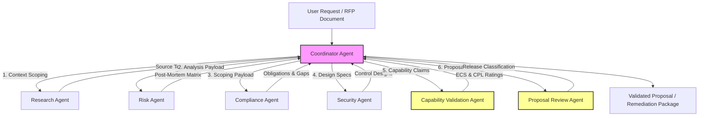

# Governance OS — Anthropic Managed Agents Audit (Consolidated)

**Date of Audit:** 2026-06-17  
**Auditor:** Anthropic Managed Agents Architect (Antigravity AI)  
**Workspace:** `governance-os` ([/Users/ajayrajsingh/Documents/governance-os](file:///Users/ajayrajsingh/Documents/governance-os))  
**Scope:** Evaluation of Skill and Tool boundaries, Progressive Disclosure patterns, Multi-Agent orchestration, and MCP integration readiness.

---

## 1. Executive Summary

This audit evaluates the Governance OS repository against Anthropic's **Managed Agents** and **Model Context Protocol (MCP)** architectural standards. 

Currently, Governance OS has a well-parameterized, structured skill layer that serves as a logical foundation. However, the repository lacks the execution wrapper: the `agents/` folder is empty, and workflows exist only as documentation. To achieve production readiness, the repository must transition from static execution guidelines to an autonomous multi-agent mesh coordinated by a central router agent, using MCP tool abstractions for file, database, and verification operations.

**Maturity Classification: Multi-Agent Ready (Conceptual Stage)**  
**Readiness Score: 45 / 100**

---


---

## 2. Recommended Agent Topology

The diagram below visualizes the target orchestration flow, showcasing how the central Coordinator Agent progressively discloses payloads to specialist agents, enforcing the Claims Firewall and verification gates.



---


---

## 3. Recommended Agent Structure

To operationalize the topology, we recommend implementing the following seven managed agents under the [agents/](file:///Users/ajayrajsingh/Documents/governance-os/agents) directory:

### 3.1 Coordinator Agent
*   **Role:** Central router, task triager, and context manager.
*   **System Prompt:** *You are the Coordinator Agent for Governance OS. Your role is to ingest user prompts, construct the execution DAG, delegate tasks to specialized subagents, manage progressive context disclosure, and enforce quality gate thresholds between skill execution steps.*
*   **Tools:** `list_directory`, `workflow_validator_tool`, `agent_certifier_tool`.
*   **Decoupling Strategy:** Maintains the execution state, resolving circular dependencies by sequentially passing control design requirements to the Security Agent and feeding technical fit outputs to the Compliance Agent for final review.

### 3.2 Research Agent
*   **Role:** Context validator and knowledge-base searcher.
*   **System Prompt:** *You are the Research Agent. Your role is to search the knowledge base directories, extract regulatory text and incident details, and summarize client-specific documents without making policy or control design decisions.*
*   **Tools:** `knowledge_semantic_search_tool`, `read_file`.

### 3.3 Risk Agent
*   **Role:** AI Incident and failure analyst.
*   **System Prompt:** *You are the Risk Agent. Your role is to ingest raw incident logs, execute the AI Incident Analysis skill, analyze root causes using 5-Whys methodology, and map failures to framework control categories.*
*   **Orchestrated Skill:** `skills/ai-incident-analysis/`
*   **Tools:** `read_file`, `write_incident_analysis_tool`.

### 3.4 Compliance Agent
*   **Role:** Regulatory classifier and gap assessor.
*   **System Prompt:** *You are the Compliance Agent. Your role is to ingest AI use cases and target jurisdictions, execute the Regulatory Mapping and ISO 42001 Gap Assessment skills, determine regulatory tiers (such as EU High Risk), and output compliance obligations.*
*   **Orchestrated Skills:** `skills/regulatory-mapping/`, `skills/iso-42001-gap-assessment/` (Planned).
*   **Tools:** `read_file`, `write_regulatory_mapping_tool`.

### 3.5 Security Agent
*   **Role:** Control designer and technical fit scoping agent.
*   **System Prompt:** *You are the Security Agent. Your role is to translate compliance obligations and incident findings into operational control specifications, verify Ethana feature readiness against the technical environment, and output preventive, detective, and corrective controls.*
*   **Orchestrated Skills:** `skills/governance-control-mapping/`, `skills/ethana-feature-mapping/`.
*   **Tools:** `read_file`, `write_control_specification_tool`, `verify_feature_compatibility_tool`.

### 3.6 Capability Validation Agent
*   **Role:** Product truth-gate and claims firewall validator.
*   **System Prompt:** *You are the Capability Validation Agent. Your role is to evaluate specific commercial claims against Cursory's canonical engineering states, check for prohibited sources, compute Evidence Confidence Scores (ECS), and assign Claim Permission Levels (CPL).*
*   **Orchestrated Skill:** `skills/ethana-capability-validation/`
*   **Tools:** `claims_linter_tool`, `read_canonical_product_model_tool`.

### 3.7 Proposal Review Agent
*   **Role:** Final release gate and proposal auditor.
*   **System Prompt:** *You are the Proposal Review Agent. Your role is to ingest draft proposal documents, verify that all capabilities map to validated production features, check for claims firewall compliance, and output the final Release Classification.*
*   **Orchestrated Skill:** `skills/proposal-review/` (Planned).
*   **Tools:** `claims_linter_tool`, `regression_tester_tool`.

---


---

## 4. Skills vs. Agents Classification

To maintain Anthropic's efficiency guidelines, we classify repository operations into **Agents** (which require planning, multi-step tool use, and cognitive execution) and **Skills** (parameterized, deterministic tasks that can be wrapped as tools called by agents).

| Operation / Capability | Classification | Rationale |
| :--- | :---: | :--- |
| **AI Incident Analysis** | **Agent-Led** | Requires cognitive root-cause reasoning and narrative generation. |
| **Regulatory Mapping** | **Agent-Led** | Involves jurisdictional matching and multi-factor classification. |
| **Ethana Capability Validation** | **Agent-Led** | Requires evidence adjudication and claim permission decision-making. |
| **Ethana Solution Mapping** | **Agent-Led** | Combines commercial scoping and proposal narrative creation. |
| **Ethana Feature Mapping** | **Agent-Led** | Involves technical constraint mapping and POC test design. |
| **Governance Control Mapping** | **Agent-Led** | Requires complex specification design and RACI allocation. |
| **Claims Firewall Linting** | **Skill (Tool)** | Deterministic regex/text scanning checks against a schema. |
| **Structural Regression Check** | **Skill (Tool)** | Deterministic verification of markdown headings and tables. |
| **Payload Schema Validation** | **Skill (Tool)** | Zero-dependency JSON schema parsing. |
| **Scorecard Compilation** | **Skill (Tool)** | Mathematical aggregation of local skill metrics. |
| **ISO 42001 Gap Assessment** | **Skill (Tool)** | Crosswalk mapping and maturity matrix scoring. |

---


---

## 5. Architectural Evaluation & Gap Analysis

### 5.1 Skill and Tool Boundary Gaps
*   **No MCP Tool Schemas:** The skills are parameterised conceptually, but they are not exposed as JSON schemas matching the Model Context Protocol. Anthropic agents cannot automatically invoke them because there are no schema wrappers (e.g., `schema.json` in each skill folder defining tool arguments).
*   **Lack of Read/Write Sandboxing:** Specialist agents require read-only access to the knowledge base but write access only to their specific draft outputs. These directory boundaries are not enforced at the file system or tool proxy level.

### 5.2 Coordinator & Routing Gaps
*   **State Machine Absence:** There is no centralized workflow manager. Payloads are passed ad-hoc, which blocks progressive disclosure (e.g., the Compliance Agent should not see the competitor pricing model, but currently, both reside in the same flat folder).
*   **Human-in-the-Loop Interrupter Missing:** For high-stakes actions (such as publishing a proposal or classifying a CPL-5 claim), Anthropic agents require a prompt gate that pauses execution and awaits human input. No such gate mechanism is implemented.

### 5.3 Multi-Agent Workflow Gaps
*   **No Decoupled DAG Pipelines:** The circular loop between Control Mapping (`GCM`) and Feature Mapping (`EFM`) has no intermediate queue. If implemented directly, the agents will loop indefinitely.

---


---

## 6. Readiness Score Breakdown

| Dimension | Score | Assessment | Gaps to Resolve |
| :--- | :---: | :--- | :--- |
| **1. Skill & Tool Design** | **12 / 20** | Semi-Mature | parameterized markdown exists; MCP JSON tool schemas are missing. |
| **2. Agent Boundaries & Isolation** | **8 / 20** | Immature | Conceptual boundaries documented; directory-level tool permissions are missing. |
| **3. Coordinator & Orchestration** | **2 / 20** | Immature | Coordinator logic is missing; no state machine or DAG runner. |
| **4. Multi-Agent Integration** | **13 / 20** | Semi-Mature | Input/output JSON schemas are complete, enabling smooth data serialization. |
| **5. Evaluation & Lifecycle** | **10 / 20** | Semi-Mature | Linter, regression tester, and certifier scripts are implemented. |
| **Total Score** | **45 / 100** | **Conceptual Multi-Agent State** | **Focus:** Wrap skills as tools, decouple circular loops, and code the Coordinator Agent. |

---


---

## 7. Implementation Roadmap

```
Phase 1: Toolification (Weeks 1-2)
  ├── 1. Author JSON schemas for all 6 skills under workflows/schemas/tool-specs/
  ├── 2. Implement MCP server exposing evaluations/scripts as executable tools
  └── 3. Create capability_validation_output.json schema in workflows/schemas/

Phase 2: Decoupling & Coordinator Build (Weeks 3-4)
  ├── 1. Refactor GCM $\rightarrow$ EFM boundary, routing EFM technical outputs to a validation queue
  ├── 2. Implement coordinator_agent.py managing state transitions and payload validation
  └── 3. Implement the Human-in-the-loop (HITL) prompt-gate in coordinator_agent.py

Phase 3: Specialist Agent Generation (Weeks 5-6)
  ├── 1. Implement specialist agent templates under agents/ specialist folders
  ├── 2. Configure read/write tool directories per agent (enforcing Progressive Disclosure)
  └── 3. Implement the missing ISO 42001 Gap Assessment and Proposal Review skills

Phase 4: Multi-Agent Validation Sweep (Week 7)
  ├── 1. Populate evaluations/test-cases/ with mock RFPs and regulatory profiles
  └── 2. Run end-to-end regression tests to verify that the Coordinator enforces the claims firewall
```


---

## 8. Detailed Architectural Critique & Engineering Gap Analysis

This section contains the granular critique of the repository's architecture against Anthropic's agent engineering principles (stopping conditions, reversibility, context budgets, and memory models).

## Preamble: The Core Diagnosis

The repository is not an agent system. It is a **structured prompting library** — a set of carefully written system prompts (called skills), human-readable workflow guides (called workflows), and a knowledge base — with no agent runtime, no tool definitions, no orchestration code, and no memory. It is well-designed as a prompting library. It is not designed as an agent system at all.

Every score below must be read with this in mind. The specification work is often excellent. The architecture it specifies does not exist.

---

## 1. Agent Design

**Score: 8/100**

### What exists
Five to seven agents are described across `README.md`, `implementation-status.md`, `repository-maturity-review.md`, and `agent_certifier.py`. The `agents/` directory is empty. There is no agent code, no agent base class, no agent loop, and no agent configuration.

### Violations of Anthropic agent design principles

**No stopping conditions defined.**  
Anthropic requires every agent to have explicit termination criteria: what constitutes task completion, what constitutes an unrecoverable failure, and what triggers escalation to a human. None of the documented agents define stopping conditions. The `agent_certifier.py` checks whether required skills exist but has no concept of what the agent should do when a skill returns a low score, a firewall breach, or an ambiguous output.

**No minimal footprint design.**  
Anthropic's principle: agents should request only the permissions they need, avoid storing sensitive information beyond immediate needs, and prefer reversible over irreversible actions. The Regulatory Watch Agent is described as both a scheduled monitor and a workflow executor — combining polling, analysis, and downstream document production in one agent definition. This conflates footprint. An agent that reads regulatory feeds (read-only, low blast radius) should be separated from one that triggers workflow execution (write, higher blast radius).

**No reversibility classification for agent actions.**  
The Incident Intelligence Agent produces a "Remediation Package" — a document recommending controls. This is reversible (a document can be revised). A Control Validation Agent that runs tests against client infrastructure is partially irreversible (tests leave traces). The Ethana Proposal Agent produces a commercial proposal — not reversible once sent to a client. These agents are architecturally identical in the current design despite operating at completely different blast radii.

**No trust hierarchy.**  
Anthropic's multi-agent pattern requires explicit trust levels. An orchestrator agent grants trust to subagents. Subagents should not trust inputs that claim to be from an orchestrator without verification. The current design has no orchestrator, no subagents, and no trust model between agents.

**Reactive and proactive agents conflated.**  
The Incident Intelligence Agent (event-triggered, reactive) and Regulatory Watch Agent (scheduled, proactive) share no architectural distinction in the documentation. Anthropic treats these as fundamentally different patterns. A reactive agent needs an event listener and triage gate; a proactive agent needs a scheduler, a change-diffing mechanism, and a deduplication layer.

### Recommended corrections
- Define a `GovernanceOrchestrator` as the single top-level agent
- All other agents become subagents with explicit tool bindings and trust grants from the orchestrator
- Define stopping conditions for every agent: completion criteria, failure criteria, escalation trigger
- Classify every agent action by reversibility before implementing

---

## 2. Skill Design

**Score: 44/100**

### What exists
Six skills, each defined by four markdown files: `SKILL.md` (specification), `workflow.md` (execution procedure), `evaluation.md` (quality rubric), `examples.md` (worked examples). Input specifications are well-structured. Output specifications are thorough.

### Violations of Anthropic tool design principles

**Skills are not tools — they are system prompts.**  
In Anthropic's agent architecture, a skill corresponds to a **tool** — a function with a typed JSON schema for inputs, a defined return type, and a discrete, bounded scope. The current skills are full system prompts meant to guide a model through a complex multi-hour workflow. They are not callable tools. An agent cannot invoke `governance-control-mapping` as a tool call; a human must read the SKILL.md, construct a prompt, run it manually, and evaluate the result.

**Skills produce outputs that are too large for tool use.**  
Anthropic's principle: tool outputs should be discrete, structured, and sized to fit within the orchestrator's planning context without consuming the entire context window. The `governance-control-mapping` skill produces 10 sections — an output that could easily reach 5,000–15,000 tokens. When this output is passed to the next skill in a workflow, it dominates the context. An orchestrator receiving this as a tool result has almost no context budget left for its own reasoning.

| Skill | Sections | Estimated output tokens | Anthropic tool fit |
|---|---|---|---|
| ai-incident-analysis | 10 | 4,000–12,000 | Poor |
| regulatory-mapping | 9 | 5,000–15,000 | Poor |
| ethana-capability-validation | 9 | 3,000–8,000 | Poor |
| ethana-solution-mapping | 10 | 4,000–12,000 | Poor |
| ethana-feature-mapping | 10 | 5,000–15,000 | Poor |
| governance-control-mapping | 10 | 6,000–18,000 | Poor |

**Skills conflate planning and execution.**  
Each skill's `workflow.md` is a step-by-step execution guide (Phase 1: Intake, Phase 2: Root Cause, Phase 3: Classification...). This is the agent's reasoning procedure, not the tool's function. Anthropic separates these: the tool does one thing, the agent decides how to sequence tool calls. Embedding the reasoning procedure inside the tool specification blurs this separation and makes the skill unusable in an agent loop.

**No error return types defined.**  
Every Anthropic tool needs a defined failure mode — what it returns when it cannot complete successfully. The skills have no error contract. If `regulatory-mapping` cannot determine applicability because the jurisdiction is unsupported, there is no defined error output structure. The agent receiving this has no typed signal that the tool failed.

### What is done well
- Input specifications are well-structured with required/optional field tables
- Depth calibration notes reflect an understanding of different use contexts
- The `examples.md` files are detailed and realistic
- Constraints sections are explicit and thorough
- The Claims Firewall is a well-designed hard constraint

---

## 3. Skill Boundaries

**Score: 38/100**

### Violations

**Skills are too coarse — each should decompose into 3–6 atomic tools.**  
Anthropic's principle: tools should do one thing precisely. A 10-section governance assessment is not one thing — it is ten things sequenced by a workflow. Each section should be an independent tool that the orchestrator can call selectively based on what the task requires.

Decomposition example for `ai-incident-analysis`:

```
Current:  ai-incident-analysis (10 sections, one invocation)

Should be:
  classify_incident(description) → {type, evidence_quality, scope_decision}
  analyze_root_cause(incident_facts) → {proximate_cause, whys_chain, root_cause}
  map_control_failures(root_cause) → [{control_name, type, failure_mode}]
  map_to_frameworks(incident_facts, control_failures) → {iso42001, nist, owasp}
  assess_regulatory_implications(incident_facts, jurisdictions) → {regulations, obligations}
  assess_bfsi_impact(incident_facts) → {relevant: bool, exposure, frameworks}
  extract_lessons(root_cause, control_failures) → [{lesson, applicability, urgency}]
  recommend_controls(control_failures, risk_category) → [{control, complexity, priority}]
  write_executive_summary(all_above) → {summary_text}
```

The orchestrator then decides which tools to call and in what order based on the task. A quick triage call invokes only `classify_incident`. A full board-ready analysis invokes all nine in sequence.

**Circular dependency between GCM and EFM is a boundary violation, not a design pattern.**  
`governance-control-mapping` outputs to `ethana-feature-mapping` (control specs → POC scope) and EFM feeds back to GCM (validated features → control revision). In Anthropic's tool model, a tool cannot depend on the output of a tool that depends on its output in the same execution chain. This creates an unresolvable tool call graph. The correct fix: GCM is a pure function that takes risks and produces control specs. EFM is a pure function that takes control specs and validates them technically. If EFM finds gaps, it returns a gap report. The orchestrator decides whether to call GCM again for a revision pass — the feedback loop lives in the orchestrator, not in the tools.

**`ethana-capability-validation` has the wrong scope for a skill.**  
It validates a capability claim — this is a lookup operation with a conditional logic layer. It should be implemented as a middleware function (`truth_gate`) called automatically by the tool runtime on every output that contains an Ethana capability reference, not as a peer skill that requires a human decision to invoke. As a skill, it creates an optional gate. As middleware, it creates an unconditional gate. The Claims Firewall should be unconditional.

**Three ghost downstream skills in `ai-incident-analysis`.**  
The Related Skills section lists `skills/risk-assessment/`, `skills/framework-gap-analysis/`, and `skills/regulatory-exposure/` — none exist. In a tool registry, these would be runtime errors: the orchestrator would call a tool that is not registered and fail.

---

## 4. Skill Descriptions

**Score: 51/100**

### What Anthropic requires from tool descriptions
Tool descriptions must tell the model **when to call the tool**, not just what the tool does. The description is the model's only decision signal for whether to invoke the tool. It must be: unambiguous, specific about scope, explicit about when NOT to use it, and brief enough to be processed efficiently.

### Assessment

**"When to Use This Skill" sections are good but not tool-description formatted.**  
Each SKILL.md has a "When to Use" section with 6–8 bullet points. This is good advisory content. As a tool description, it is too long. A tool description is typically 1–3 sentences in production systems. The "When to Use" content needs to be distilled into a single, decisive description sentence.

Example — what a compliant `ai-incident-analysis` tool description looks like:
> "Classifies and analyses AI incidents — security incidents, agent failures, model failures, governance events. Returns structured findings including root cause, control failures, framework mapping, and recommended controls. Do not call for pure cybersecurity incidents with no AI-specific dimension. Returns {error: 'INSUFFICIENT_EVIDENCE'} when evidence quality is Low."

**Skills have identical structural naming that creates selection ambiguity.**  
`ethana-solution-mapping` and `ethana-feature-mapping` have names that are not sufficiently distinct for an orchestrator making a selection decision. Tool names should be self-explanatory: `map_requirements_to_proposal` vs `validate_features_for_poc` eliminates this ambiguity without requiring the orchestrator to read a SKILL.md.

**The skill hierarchy is not expressed in descriptions.**  
`ethana-capability-validation` is architecturally upstream of both solution mapping and feature mapping. But nothing in the tool name or description expresses this ordering constraint. An orchestrator without explicit sequencing instructions could call solution mapping before capability validation, bypassing the Claims Firewall.

---

## 5. Progressive Disclosure

**Score: 28/100**

### Assessment

**Depth calibration is documented but not a tool parameter.**  
Every SKILL.md has a "Depth calibration" note. This is excellent guidance for human analysts but cannot be machine-invoked. There is no `depth: "condensed" | "standard" | "full"` parameter on any tool schema.

**No fast-path tool variants.**  
The `ethana-capability-validation` workflow defines two execution paths: full (65–80 minutes, all 9 phases) and abbreviated (25–30 minutes, 5 phases). These should be two separate tools or one tool with a `mode` parameter.

**No early termination gates surfaced as typed outputs.**  
The `ai-incident-analysis` workflow Phase 1 makes a go/no-go decision. This is a correct progressive disclosure pattern — but it is embedded inside a monolithic workflow, not surfaced as an explicit typed output that the orchestrator reads before deciding whether to proceed.

---

## 6. Evaluation Framework

**Score: 33/100**

### What exists — stronger than it appears
Four Python scripts are implemented and functional:
- `claims_linter.py` — parses canonical-product-model.md, scans outputs for firewall violations. Hard constraint enforcement. Best piece in the evaluation layer.
- `regression_tester.py` — validates structural headers and table columns against a baseline JSON
- `workflow_validator.py` — JSON schema validation of inter-skill payloads with fallback to custom validator
- `agent_certifier.py` — 4-level readiness certification (L0: missing skills → L4: production code committed)

### What is missing against Anthropic evaluation standards

**No LLM-as-judge.**  
Anthropic's recommended evaluation pattern includes using a separate LLM invocation as an evaluator. The `regression_tester.py` checks structure (are the right headers present?) but not quality (is the root cause analysis actually correct?). A structurally correct but analytically wrong incident analysis passes the current evaluation.

**No behavioral tests.**  
Anthropic distinguishes between unit tests (format correctness) and behavioral tests (does the tool do the right thing in adversarial inputs?). No test cases exist for: unsupported jurisdiction inputs, misspelled capability names, adversarial prompt injection in incident descriptions, ambiguous scope conditions.

**No test data.**  
`evaluations/test-cases/` contains only a README. The three subdirectories (`incident-reports/`, `regulatory-subjects/`, `gold-standards/`) do not exist. Evaluation scripts have nothing to run against.

**Parser correctness issue in regression_tester.py.**  
The table parser sets `in_table = True` after finding the header row, then `continue`s for separator and all data rows. This means it validates that a header row exists with the right columns but does not correctly validate separator patterns for all edge cases and skips all data rows. Table data content is unvalidated.

**`scorecard_compiler.py` is a stub.**  
No code path takes a completed skill output, applies a rubric, and returns a numeric score. The rubrics are human review checklists, not automated evaluation functions.

**No calibration dataset.**  
Without human-scored examples to calibrate against, any LLM-as-judge implementation will produce uncalibrated scores with unknown correlation to expert judgment.

---

## 7. Agent Orchestration

**Score: 5/100**

### Missing against Anthropic orchestration standards

**No orchestrator agent.**  
Anthropic's model for complex multi-step tasks: a single orchestrator reads the task, decomposes it into subtasks, calls tools in sequence or parallel, manages state, handles failures, and produces the final result. There is no orchestrator. Workflow execution is manual.

**Shared components exist only as markdown abstractions.**  
`comp.truth_gate`, `comp.control_architect`, and `comp.raci_assigner` are documented as shared components but have no implementation. In a production system, shared components are tools that multiple agents can call.

**No parallel execution design.**  
The proposal development workflow sequences five skills. Steps ESM and EFM could run in parallel after GCM completes — both consume GCM output independently. Sequential execution when parallel is possible doubles latency unnecessarily.

**No checkpoint/resume.**  
A workflow with five 45–90 minute skill invocations could span 7 hours. A failure at step 4 requires restarting from step 1. Anthropic recommends checkpointing workflow state after each successful step.

**No conditional branching.**  
If `regulatory-mapping` returns "Minimal Risk," subsequent `governance-control-mapping` requires significantly less depth. If `ethana-capability-validation` returns CPL-5 (prohibited), `ethana-solution-mapping` should route to gap register immediately. No conditional routing exists in any workflow.

---

## 8. Multi-agent Readiness

**Score: 5/100**

### Violations of Anthropic multi-agent principles

**No trust model.**  
When an orchestrator passes instructions to a subagent, the subagent should grant the orchestrator operator-level trust. The current system has no trust model defined for any inter-agent communication.

**No agent-to-agent communication protocol.**  
No message format, no queue, no event bus. There is no mechanism for the Regulatory Watch Agent to notify other agents that a regulation affecting an existing client assessment has changed.

**No shared memory architecture.**  
Without shared external memory (a database or key-value store that all agents can read and write), each agent starts with zero knowledge of prior interactions.

**No inter-agent prompt injection protection.**  
When agents communicate, content passed between them is a potential injection vector. If the Incident Intelligence Agent reads an incident report containing adversarial text and passes its analysis downstream, the adversarial text could influence the next agent's behavior. No injection barrier is designed.

**Subagent scope is unbounded.**  
The current agent descriptions do not define what tools each agent has access to, what scope boundaries constrain it, or what actions it cannot take even if a tool call would technically succeed.

---

## 9. Tool Architecture

**Score: 8/100**

### What exists
Five workflow-level JSON schemas under `workflows/schemas/` define inter-skill payload structures. `workflow_validator.py` validates payloads against these schemas. These are handoff schemas (message formats), not tool interfaces.

### What is missing

**No tool function definitions.**  
No Anthropic-compatible tool JSON function schemas exist. Skills are system prompts, not callable function definitions.

**No tool registry.**  
Without a registry, each agent's tool set must be hardcoded. When a new skill is added, every agent that should use it must be manually reconfigured.

**No error contracts.**  
When a skill fails (low evidence quality, unsupported jurisdiction, claims firewall breach), there is no typed error structure the orchestrator can route on.

**No tool versioning.**  
A skill specification change can silently break downstream agents with no detection mechanism.

---

## 10. Knowledge Architecture

**Score: 32/100**

### Assessment

**Knowledge is not retrieval-optimized.**  
The knowledge base is designed for a human analyst who reads the relevant file before executing a skill. In an agent system, knowledge is retrieved dynamically. The current architecture assumes the entire knowledge file is read in full — injecting a 5,000-word regulatory file into context for a simple classification query wastes tokens and pollutes the model's attention.

**No chunking strategy.**  
Large knowledge files should be chunked into independently retrievable segments. `canonical-product-model.md` has distinct sections (Build/Edge/Workspace, Production/In Build/Aspirational) that should each be independently retrievable. Currently the full file is injected for every capability validation.

**No embedding / vector retrieval.**  
Anthropic's knowledge architecture for agents uses embedding-based retrieval: questions are embedded, relevant knowledge chunks are retrieved by semantic similarity, and only relevant chunks are injected into context. No vector store, no embedding pipeline, no retrieval layer exists.

**The canonical model is a lookup table, not a retrieval service.**  
In a tool architecture, `canonical-product-model.md` should be a structured lookup service: `get_capability_status("LLM Gateway")` returns `{"status": "Production", "caveats": [...], "scope": {...}}`. Instead, it is a large markdown table requiring the model to scan the full document for every lookup.

**Knowledge freshness is unmanaged.**  
Agents using `eu-ai-act.md` have no way of knowing whether the content reflects the current state of the law. No staleness detection, no version tagging, no refresh mechanism.

---

## 11. Context Management

**Score: 14/100**

### Violations

**No context budget management.**  
Anthropic recommends tracking token consumption across workflow steps and compressing when the remaining context budget falls below a threshold. The proposal development workflow invokes five skills sequentially. By step 4, the context window contains the system prompt, all prior skill outputs, and the current skill input — potentially exceeding even large context windows.

**Skills pass complete outputs instead of extracts.**  
When `regulatory-mapping` Section 6 (Control Requirements) is passed to `governance-control-mapping`, the entire 9-section regulatory-mapping output is typically the payload. GCM only needs Section 6. Anthropic's principle: pass only the minimum required context to each downstream step.

**SKILL.md files are injected as system prompts in their entirety.**  
`governance-control-mapping` SKILL.md is approximately 3,500 words; `ethana-capability-validation` is approximately 4,000 words. When used as system prompts, these consume 4,000–6,000 tokens before the first user message is processed.

**No streaming or incremental output design.**  
Anthropic recommends that long-running tool outputs support incremental delivery — the orchestrator can read section 1 while section 2 is being generated, and can halt execution if section 1 reveals the task should not proceed.

---

## 12. Memory Strategy

**Score: 7/100**

### Missing memory types

**No working memory for workflow state.**  
State accumulated across steps (which controls were identified, which capabilities were validated, which regulatory obligations were mapped) must persist across tool invocations. No working memory exists — each skill invocation is stateless.

**No episodic memory across client engagements.**  
If the Incident Intelligence Agent analyses a prompt injection incident for Client A, six months later Client B faces a similar incident and the agent starts from zero. No precedent recall.

**No semantic memory for knowledge retrieval.**  
Without a vector store embedding the knowledge base, the agent either reads full files (expensive) or misses relevant knowledge (inaccurate).

**No long-term memory for client state.**  
Client assessments, risk registers, maturity baselines, and evidence vaults are nowhere stored. Each client engagement begins with zero memory of prior interactions.

**The Claims Firewall enforcement is stateless.**  
If a claim is adjudicated as CPL-5 (Prohibited) today, there is no memory of this decision. Tomorrow, a different agent could make the same prohibited claim without triggering the prior prohibition.

---

## 13. Scalability

**Score: 5/100**

The system is manually executed. A single governance-control-mapping assessment takes a human analyst 60–90 minutes. To serve 10 concurrent clients, 10 analysts are needed. This is a consulting methodology, not an operating system.

### Missing scalability patterns

**No parallelization.** Independent skill invocations in the same workflow run sequentially when they could run in parallel, doubling or tripling wall-clock time unnecessarily.

**No caching for canonical model lookups.** `canonical-product-model.md` is re-read and re-parsed for every capability validation. The resolved capability status for each capability should be cached per session.

**No throughput design.** No rate limiting, no queue management, no priority scheduling, no concurrency model.

---

## Score Summary

| Dimension | Score | Weight | Weighted |
|---|---|---|---|
| Agent Design | 8 | 1.0× | 8 |
| Skill Design | 44 | 1.5× | 66 |
| Skill Boundaries | 38 | 1.5× | 57 |
| Skill Descriptions | 51 | 1.0× | 51 |
| Progressive Disclosure | 28 | 0.75× | 21 |
| Evaluation Framework | 33 | 1.0× | 33 |
| Agent Orchestration | 5 | 1.5× | 8 |
| Multi-agent Readiness | 5 | 1.0× | 5 |
| Tool Architecture | 8 | 1.5× | 12 |
| Knowledge Architecture | 32 | 1.0× | 32 |
| Context Management | 14 | 1.0× | 14 |
| Memory Strategy | 7 | 1.0× | 7 |
| Scalability | 5 | 0.75× | 4 |

**Anthropic Compliance Score: 22/100**

**Skill Quality Score: 52/100** — Excellent advisory specifications; not Anthropic-compatible tool definitions.

**Agent Quality Score: 5/100** — Implementation: 0. Design specification: 32. Everything else: 0.

---

## Missing Skills (Anthropic tool-format)

| Tool Name | Function | Called By |
|---|---|---|
| `classify_incident` | Type + evidence quality determination | Incident orchestrator |
| `analyze_root_cause` | 5-Whys chain from incident facts | Incident orchestrator |
| `get_capability_status` | Single capability lookup from canonical model | Truth gate middleware |
| `check_claim_permission` | CPL assignment for a specific claim + context | Truth gate middleware |
| `extract_regulatory_obligations` | Obligations for a specific regulation + jurisdiction | Compliance orchestrator |
| `classify_ai_system` | Risk tier under a named framework | Discovery orchestrator |
| `design_preventive_control` | Single preventive control spec for a named risk | Control orchestrator |
| `design_detective_control` | Single detective control spec for a named risk | Control orchestrator |
| `design_corrective_control` | Single corrective control spec for a named risk | Control orchestrator |
| `score_output` | LLM-as-judge scoring against named rubric | All orchestrators |
| `summarize_for_executive` | Compress full analysis to 200-word board summary | All orchestrators |
| `generate_raci_entry` | RACI assignment for a named control | Control orchestrator |
| `validate_schema` | JSON schema validation of tool output | Workflow engine |
| `lint_claims` | Claims firewall check on any text | Truth gate middleware |
| `compute_coverage_score` | CCS or TFS for a specific requirement + capability | Proposal orchestrator |

---

## Missing Agents

| Agent | Type | Purpose | Blocked By |
|---|---|---|---|
| `GovernanceOrchestrator` | Master orchestrator | Top-level task decomposition and routing | Must be built first — everything else is a subagent |
| `DiscoveryAgent` | Proactive, scheduled | AI system discovery and inventory maintenance | `ai-discovery`, `ai-inventory-management` tools |
| `MonitoringAgent` | Proactive, continuous | Production AI system behavioural monitoring | `continuous-monitoring-design` tool + data layer |
| `ThirdPartyRiskAgent` | Event-triggered | Vendor AI risk assessment on procurement events | `third-party-ai-risk-assessment` tool |
| `ModelGovernanceAgent` | Lifecycle-event-driven | MRM lifecycle for AI/ML model portfolios | `model-governance-assessment`, `bias-fairness-assessment` tools |
| `AgentDeploymentAgent` | Reactive | Agent governance review before production deployment | `agent-governance-assessment` tool |
| `AuditReadinessAgent` | Examination-triggered | Evidence pack assembly for regulatory audits | `audit-pack-assembly` tool + evidence vault |

---

## Missing Evaluations

| Evaluation | Type | What It Checks |
|---|---|---|
| `llm_judge_incident_analysis` | LLM-as-judge | Root cause correctness, control failure accuracy, lesson quality |
| `llm_judge_regulatory_mapping` | LLM-as-judge | Obligation completeness, jurisdiction accuracy, classification correctness |
| `llm_judge_control_design` | LLM-as-judge | Control specificity, trigger precision, failure mode completeness |
| `behavioral_injection_test` | Adversarial | Does the system resist prompt injection in incident descriptions? |
| `behavioral_boundary_test` | Edge case | Does `regulatory-mapping` correctly handle unsupported jurisdictions? |
| `behavioral_firewall_stress_test` | Adversarial | Can a crafted input cause capability validation to pass a prohibited claim? |
| `cross_skill_consistency_check` | Integration | No claim degrades or contradicts across a full workflow execution |
| `context_budget_monitor` | Operational | Flags when workflow step input + output exceeds 60% of context window |
| `tool_latency_benchmark` | Performance | p50/p95 latency per tool call under load |
| `calibration_dataset` | Judge calibration | Human-scored examples for LLM-as-judge calibration |
| `schema_round_trip_test` | Unit | Tool output → schema validation → next tool input succeeds for all skill pairs |

---

## Missing Orchestration Patterns

| Pattern | Required For |
|---|---|
| **Orchestrator-Worker** | All multi-step governance workflows |
| **Parallel Fan-Out** | Regulatory mapping across 3 jurisdictions; multi-framework gap assessment |
| **Sequential Gate** | Every workflow step must pass quality gate before next step receives output |
| **Conditional Branch** | Risk tier → proportionate control depth; CPL-5 → gap register skip |
| **Retry with Backoff** | All tool calls |
| **Human Checkpoint** | Claims firewall breach; high-value proposal release; regulatory notification |
| **Extract-Transform-Pass** | RM Section 6 → GCM; IA Sections 4+9 → GCM |
| **Cache-Aside** | Canonical model lookups cached per session |
| **Subagent Trust Grant** | Multi-agent system — orchestrator grants operator-level trust to subagents |
| **Injection Barrier** | Incident reports → Incident Agent; vendor docs → TPAI Agent |

---

## Recommended Agent Topology

```
┌─────────────────────────────────────────────────────────────────────────────┐
│                        GOVERNANCE ORCHESTRATOR                              │
│                                                                             │
│  Receives: task_type + client_id + context                                  │
│  Decides: which specialist agent to spawn                                   │
│  Manages: state, checkpoints, human gates, agent trust grants               │
│  Never: calls governance tools directly (delegates all execution)           │
└─────────────────────────────────────────────────────────────────────────────┘
         │              │              │              │              │
         ▼              ▼              ▼              ▼              ▼
  ┌──────────┐   ┌──────────┐   ┌──────────┐   ┌──────────┐   ┌──────────┐
  │ Discovery │   │Compliance│   │ Control  │   │ Proposal │   │Incident  │
  │  Agent   │   │  Agent   │   │  Agent   │   │  Agent   │   │  Agent   │
  │          │   │          │   │          │   │          │   │          │
  │Tools:    │   │Tools:    │   │Tools:    │   │Tools:    │   │Tools:    │
  │ discover │   │ reg_map  │   │ctrl_map  │   │cap_valid │   │classify  │
  │ inventory│   │ gap_asmt │   │ctrl_dsn  │   │sol_map   │   │root_cause│
  │ classify │   │ rbi_asmt │   │ctrl_val  │   │feat_map  │   │ctrl_fail │
  └──────────┘   └──────────┘   └──────────┘   │prop_rev  │   │reg_notif │
                                                └──────────┘   └──────────┘
         │              │              │
         ▼              ▼              ▼
  ┌──────────┐   ┌──────────┐   ┌──────────┐
  │Monitoring│   │  Model   │   │  Audit   │
  │  Agent   │   │Governance│   │Readiness │
  │          │   │  Agent   │   │  Agent   │
  │Tools:    │   │          │   │          │
  │ mon_dsn  │   │Tools:    │   │Tools:    │
  │ kpi_spec │   │ mrm_asmt │   │ evid_asm │
  │ alert_cfg│   │ bias_asmt│   │ gap_det  │
  └──────────┘   │ mon_dsn  │   │ pack_gen │
                 └──────────┘   └──────────┘

━━━━━━━━━━━━━━━━━━━━━━━━━━━━━━━━━━━━━━━━━━━━━━━━━━━━━━━━━━━━━━━━━━━━━━━━━━━
                    TRUTH GATE MIDDLEWARE (not an agent)
       Intercepts all tool outputs · Claims Firewall enforced automatically
       Calls: get_capability_status + check_claim_permission + lint_claims
━━━━━━━━━━━━━━━━━━━━━━━━━━━━━━━━━━━━━━━━━━━━━━━━━━━━━━━━━━━━━━━━━━━━━━━━━━━

                        SHARED TOOL REGISTRY
    All atomic tools registered here · Versioned · Agents discover tools at runtime
```

**Key topology decisions:**
- One orchestrator, N specialist subagents — no agent-to-agent calls without orchestrator routing
- Truth Gate is unconditional middleware, not a peer agent or optional workflow step
- All agents share one tool registry — a new tool is immediately available to all agents
- Specialist agents are stateless — state lives in external memory, not in agent context

---

## Recommended Skill Topology

Skills decompose from 6 large markdown specifications into ~35 atomic tools, each with a typed JSON schema.

```
GOVERNANCE TOOL REGISTRY
│
├── INTELLIGENCE TOOLS (read-only, low blast radius)
│   ├── classify_incident(description, type) → {category, evidence_quality, scope}
│   ├── analyze_root_cause(incident_facts) → {proximate, whys_chain, root_cause, factors}
│   ├── identify_applicable_regulations(subject, jurisdictions, industry) → [{regulation, trigger}]
│   ├── map_to_frameworks(subject, context) → {iso42001, nist_rmf, owasp}
│   ├── classify_ai_risk_tier(system, framework) → {tier, rationale, obligations}
│   ├── identify_regulatory_obligations(regulation, subject) → [{obligation, article, type}]
│   └── extract_control_requirements(obligations) → [{control, type, mandatory, guidance}]
│
├── CONTROL TOOLS (design-only, no execution)
│   ├── design_preventive_control(risk, context) → {id, name, trigger, mechanism, failure_mode}
│   ├── design_detective_control(risk, context) → {id, name, telemetry, threshold, routing}
│   ├── design_corrective_control(risk, context) → {id, name, trigger, containment, recovery}
│   ├── assign_raci(control_id, sector) → {responsible, accountable, consulted, informed}
│   └── classify_control_coverage(control_id, platform) → {coverage_type, configuration}
│
├── TRUTH GATE TOOLS (middleware — called automatically, not by orchestrators)
│   ├── get_capability_status(capability_name) → {status, caveats, scope, source_quote}
│   ├── check_claim_permission(claim, context, ecs) → {cpl, permitted_contexts, prohibited}
│   ├── compute_ecs(sources_examined) → {score, band, arithmetic}
│   └── lint_claims(text) → {violations: [{claim, type, reason}], compliant: bool}
│
├── VALIDATION TOOLS (testing, evidence)
│   ├── score_output(output, rubric_file) → {score, section_scores, pass_fail, failures}
│   ├── validate_schema(payload, schema_name) → {valid: bool, errors: []}
│   ├── check_cross_skill_consistency(workflow_outputs) → {consistent: bool, conflicts: []}
│   └── assess_evidence_gap(required, available) → [{gap, severity, remediation}]
│
├── COMMERCIAL TOOLS (proposal-facing)
│   ├── map_requirement_to_capability(requirement, capabilities) → {capability, ccs}
│   ├── compute_coverage_summary(requirement_map) → {distribution, characterisation}
│   ├── generate_proposal_language(capability, context) → {claim_text, caveats, cpl}
│   ├── recommend_commercial_motion(coverage, sector) → {motion, entry, services}
│   └── compute_tfs(feature, technical_requirement, deployment) → {score, band}
│
└── SYNTHESIS TOOLS (compression, formatting)
    ├── write_executive_summary(analysis_components) → {summary_text, max_250_words}
    ├── generate_evidence_pack(controls, period, framework) → {pack_structure, artifacts}
    └── produce_raci_matrix(controls) → {matrix_table, ownership_gaps}
```

---

## Recommended Workflow Topology

```
WORKFLOW TYPES AND PATTERNS
│
├── TYPE A: REACTIVE (event-triggered, bounded, single-session)
│   │
│   ├── incident-response-workflow
│   │   Pattern: Sequential Gate + Parallel Fan-Out + Human Checkpoint
│   │
│   │   EVENT: incident report received
│   │     ↓
│   │   classify_incident → [gate: in-scope?] → EXIT if not
│   │     ↓ PARALLEL ─────────────────────────────────┐
│   │   analyze_root_cause          identify_applicable_regs
│   │     ↓ ─────────────────────────────────────────┘
│   │   [merge] → map_control_failures
│   │     ↓
│   │   design_preventive + design_detective + design_corrective (parallel)
│   │     ↓
│   │   [HUMAN CHECKPOINT: review remediation plan]
│   │     ↓ approved
│   │   generate_evidence_pack → write_executive_summary
│   │
│   └── proposal-development-workflow
│       Pattern: Sequential Gate + Truth Gate + Human Checkpoint
│
│       EVENT: proposal request
│         ↓ PARALLEL ─────────────────────────────────┐
│       identify_applicable_regs          classify_ai_risk_tier
│         ↓ ─────────────────────────────────────────┘
│       extract_control_requirements
│         ↓ PARALLEL ─────────────────────────────────┐
│       design_controls              get_capability_status (all caps)
│         ↓ ─────────────────────────────────────────┘
│       [TRUTH GATE: auto-lint all capability claims]
│         ↓ PASS
│       map_requirement_to_capability → compute_coverage_summary
│         ↓
│       generate_proposal_language → recommend_commercial_motion
│         ↓
│       [HUMAN CHECKPOINT: partner review]
│         ↓ approved
│       write_executive_summary
│
├── TYPE B: PROACTIVE (scheduled, continuous, multi-session)
│   │
│   ├── regulatory-watch-workflow
│   │   Pattern: Change-Diff + Conditional Branch + Client Notification
│   │
│   │   SCHEDULE: weekly
│   │     ↓
│   │   fetch_regulatory_updates (external feed)
│   │     ↓
│   │   diff_against_knowledge_base → [changes found?]
│   │     ↓ YES
│   │   identify_affected_clients (query evidence vault)
│   │     ↓
│   │   for each affected client: [branch by severity]
│   │     HIGH   → trigger governance-gap-assessment-workflow
│   │     MEDIUM → flag assessment as review-required
│   │     LOW    → update knowledge base, log change
│   │
│   └── monitoring-workflow
│       Pattern: Continuous Poll + Threshold Alert + Conditional Escalation
│
│       CONTINUOUS: poll Audit Log + SIEM
│         ↓
│       evaluate_kpis_against_thresholds
│         ↓
│       [BRANCH: threshold breached?]
│         NO → log, continue
│         YES → classify_severity
│           CRITICAL → trigger incident-response-workflow
│           HIGH     → notify risk owner, create review task
│           MEDIUM   → log in monitoring report
│
└── TYPE C: LIFECYCLE (multi-session, stateful, long-running)
    │
    └── client-governance-programme-workflow
        Pattern: Checkpoint-Resume + Long-Term Memory + Annual Cadence

        SESSION 1: Onboarding
          discover_ai_systems → build_inventory → [CHECKPOINT]

        SESSION 2: Baseline Assessment
          [LOAD CHECKPOINT] → classify_all_systems →
          gap_assessment (chosen framework) → [CHECKPOINT]

        SESSION 3: Control Design
          [LOAD CHECKPOINT] → design_controls_for_all_gaps →
          generate_raci → generate_evidence_schedule →
          [HUMAN APPROVAL] → [CHECKPOINT]

        ONGOING: Monthly monitoring summaries
        ANNUAL:  Re-assessment + maturity progression report
```

---

## Closing Assessment

The gap between the current state (a well-written prompting library) and the target state (a compliant Anthropic agent system) is primarily an execution gap, not a specification gap. The specifications are good. What must change is the architectural model:

- Skills must become **atomic JSON-schema tools** (one function, one purpose, typed input/output)
- The Truth Gate must become **unconditional middleware** (not a peer skill, not a human decision)
- Workflows must become **typed DAGs** with parallel execution, gates, and checkpoints
- Agents must be implemented with **explicit stopping conditions, trust grants, and memory bindings**

None of this requires rewriting the governance knowledge base — it requires building the execution layer around it.

