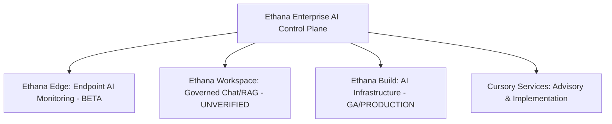

# Ethana Product & Services Source of Truth

This document serves as the single, authoritative product truth layer for the Ethana platform and Cursory Services. It resolves all contradictions between product engineering status docs (`capability-status.md`), system boundaries (`boundaries.md`), and commercial documents—specifically auditing the **Ethana Marketing Playbook (June 2026)** against verified engineering realities.

---

## 1. Core Architecture and Product Lines

Ethana is commercially positioned as an **Enterprise AI Control Plane** consisting of three product lines (**Ethana Edge**, **Ethana Workspace**, **Ethana Build**) and **Cursory Services**. However, product engineering files and board briefings show major discrepancies in the development maturity of these product lines.

### Commercial Summary & Licensing
- **Licensing Model:** Licensed per platform node per year. Pricing is consistent across SaaS, private cloud, customer VPC, and on-premises deployment models. There are **no seat-based, token-based, or volume-based charges**.
- **Pricing Structure:**
  - **Ethana Edge:** $10,000 / year (includes 1 node; extra nodes $2,000 / year)
  - **Ethana Workspace:** $10,000 / year (includes 1 node; extra nodes $2,000 / year)
  - **Ethana Build:** $30,000 / year (includes 1 node; extra nodes $5,000 / year)
  - **Enterprise AI Control Plane Bundle:** $45,000 / year (includes 1 node of each product)
- **Node Definition:** An independently deployed, managed, or governed instance (e.g., a separate region, business unit, subsidiary, or air-gapped environment).

---

## 2. Certified Compliance & Deployment Status

To maintain integrity during procurement and technical due diligence, compliance certifications and deployment models must be represented with strict accuracy.

| Certification / Deployment | Technical Scope | Status | Evidence Source |
|---|---|---|---|
| **ISO 27001** | Information security management system certification. | **Unverified – Product Validation Required** | Marketing Playbook claims certified; contradicted by Capability status file (`capability-status.md`) and Product documentation (`deployment-and-certifications.md`) which state "In progress / unverified". |
| **SOC 2 Type II** | Standard security and operational audit gate for financial services onboarding. | **In Build** (In Progress) | Capability status file (`capability-status.md`), Board briefing (`Study ethana.txt`), Product documentation (`deployment-and-certifications.md`) |
| **HIPAA-ready** | Healthcare patient data security standard readiness. | **In Build** (In Progress) | Capability status file (`capability-status.md`), Board briefing (`Study ethana.txt`), Product documentation (`deployment-and-certifications.md`) |
| **SaaS / VPC / On-Premise / Air-Gapped** | Deployment topologies for client infrastructure hosting. | **Production (GA)** | Board briefing (`Study ethana.txt`), Product documentation (`deployment-and-certifications.md`), Marketing playbook (`Ethana_Marketing_Playbook_Ajay.txt`) |
| **India VPC with Gateway PII Masking** | Localized VPC hosting with inline PII masking at the gateway. | **Production (GA)** | Product documentation (`deployment-and-certifications.md`), Marketing playbook (`Ethana_Marketing_Playbook_Ajay.txt`) |
| **On-Premise Scale (Tier 1 Banks)** | Operating at high-volume G-SIB institutional scale. | **Beta** (Stated supported, unproven at scale) | Product documentation (`deployment-and-certifications.md`) |

---

## 3. Product Capability Mapping & Statuses

The following tables map every capability within the three product lines to its verified engineering status and corroborating evidence.

### Product 1: Ethana Edge (Endpoint AI Monitoring & Governance)
*Focus: AI discovery, monitoring, and audit at the endpoint source.*

> [!WARNING]
> While the Marketing Playbook claims Ethana Edge is General Availability (GA), all engineering and board documents list it as **Beta** or **In Build**. Do not pitch Ethana Edge as a Production-ready GA product in regulated accounts.

| Capability | Technical Scope | Status | Evidence Source |
|---|---|---|---|
| **Device-Level Discovery** | Continuous discovery of all AI tools, browser extensions, developer assistants, and local models. | **Beta** (GA claim uncorroborated) | Capability status file (`capability-status.md` lists Discovery as Roadmap; `Study ethana.txt` Board briefing lists it as In Build; Marketing Playbook claims GA) |
| **Browser AI Monitoring** | Observability into prompts and responses across ChatGPT, Claude, Gemini, and consumer platforms. | **Beta** (GA claim uncorroborated) | Capability status file (`capability-status.md` lists Edge as Beta; `Study ethana.txt` Board briefing lists it as In Build; Marketing Playbook claims GA) |
| **Developer Tool Monitoring** | Observability into developer extensions (Cursor, GitHub Copilot, Claude Code, Windsurf, Cline, Aider). | **Beta** (GA claim uncorroborated) | Capability status file (`capability-status.md` lists Edge as Beta; `Study ethana.txt` Board briefing lists it as In Build; Marketing Playbook claims GA) |
| **Per-User Attribution** | Session-level activity tracking and attribution to individual employee identities. | **In Build / Roadmap** | Capability status file (`capability-status.md` lists user attribution as not available/in build; `Study ethana.txt` Board briefing lists it as In Build; Marketing Playbook claims GA) |
| **AI Asset Inventory** | Real-time device-level inventory including active MCP servers on endpoints. | **Beta** (GA claim uncorroborated) | Capability status file (`capability-status.md` lists Edge as Beta; `Study ethana.txt` Board briefing lists it as In Build; Marketing Playbook claims GA) |
| **Immutable Audit Logs** | Local-to-dashboard compliance logs suitable for regulatory inspections. | **Beta** (GA claim uncorroborated) | Capability status file (`capability-status.md` lists Edge as Beta; `Study ethana.txt` Board briefing lists it as In Build; Marketing Playbook claims GA) |
| **Endpoint Agent Deployment** | Intune / Jamf-compatible agent for Mac, Linux, and Windows + browser extension. | **Beta** | Capability status file (`capability-status.md`), Board briefing (`Study ethana.txt`) |
| **Sensitive Data Redaction** | Masking PII, secrets, and source code at the browser before prompts leave the device. | **Roadmap** | Board briefing (`Study ethana.txt`), Marketing playbook (`Ethana_Marketing_Playbook_Ajay.txt`) |
| **AI Website Egress Blocking** | Website allowlists, blocklists, and browser-level policy enforcement. | **Roadmap** | Board briefing (`Study ethana.txt`), Marketing playbook (`Ethana_Marketing_Playbook_Ajay.txt`) |

---

### Product 2: Ethana Workspace (Governed AI Workspaces & Knowledge Assistants)
*Focus: Governed collaboration and RAG on internal documents.*

> [!CAUTION]
> **Ethana Workspace is entirely unverified.** It does not appear in any engineering capability status documents, product documentation, or board briefings. Treat the entire Workspace product line as a marketing-only concept that requires engineering validation before commercial commitment.

| Capability | Technical Scope | Status | Evidence Source |
|---|---|---|---|
| **Governed Enterprise Chat** | Multi-user chat interface, shared workspaces, and department copilots. | **Unverified – Product Validation Required** | Supported **only** by Marketing Playbook (`Ethana_Marketing_Playbook_Ajay.txt`); uncorroborated in product docs/board briefings. |
| **Document RAG Integration** | RAG query pipelines connected to SharePoint, Confluence, Notion, Google Drive, and databases. | **Unverified – Product Validation Required** | Supported **only** by Marketing Playbook (`Ethana_Marketing_Playbook_Ajay.txt`); uncorroborated in product docs/board briefings. |
| **Workflows & Drafting** | Document drafting, summarization, and structured review workflows within the secure boundary. | **Unverified – Product Validation Required** | Supported **only** by Marketing Playbook (`Ethana_Marketing_Playbook_Ajay.txt`); uncorroborated in product docs/board briefings. |
| **RBAC on Knowledge Sources**| Role-based access controls for folder, document, and vector database retrieval. | **Unverified – Product Validation Required** | Supported **only** by Marketing Playbook (`Ethana_Marketing_Playbook_Ajay.txt`); uncorroborated in product docs/board briefings. |
| **PII Auto-Masking in Storage** | PII auto-masked in vector storage, unmasked only for authorized roles. | **Unverified – Product Validation Required** | Supported **only** by Marketing Playbook (`Ethana_Marketing_Playbook_Ajay.txt`); uncorroborated in product docs/board briefings. |
| **Immutable Chat Logging** | Tamper-proof logging of all prompts, responses, and document exports. | **Unverified – Product Validation Required** | Supported **only** by Marketing Playbook (`Ethana_Marketing_Playbook_Ajay.txt`); uncorroborated in product docs/board briefings. |

---

### Product 3: Ethana Build (AI Infrastructure & Control Plane)
*Focus: Infrastructure, API gateway, guardrails, and evaluation for internal AI applications.*

> [!NOTE]
> Ethana Build contains the core production capabilities of the platform (Gateway, Guardrails, and Logs) and maps directly to the primary regulatory compliance drivers.

| Capability | Technical Scope | Status | Evidence Source |
|---|---|---|---|
| **LLM Gateway** | OpenAI-compatible API gateway routing to OpenAI, Anthropic, Gemini, Groq, Cerebras, and self-hosted models. | **Production (GA)** | Capability status file (`capability-status.md`), Board briefing (`Study ethana.txt`), Product documentation (`ai-gateway.md`), Marketing playbook (`Ethana_Marketing_Playbook_Ajay.txt`) |
| **Multi-Model Routing** | SLA, cost, and reliability-aware routing and fallback. | **Production (GA)** | Capability status file (`capability-status.md`), Board briefing (`Study ethana.txt`), Product documentation (`ai-gateway.md`), Marketing playbook (`Ethana_Marketing_Playbook_Ajay.txt`) |
| **Runtime Guardrails** | Bidirectional inline scanners checking prompts and responses. Scanners: PII, Prompt Injection, Jailbreak, Toxicity, Secrets, and Bias. | **Production (GA)** | Capability status file (`capability-status.md`), Board briefing (`Study ethana.txt`), Product documentation (`guardrails.md`), Marketing playbook (`Ethana_Marketing_Playbook_Ajay.txt`) |
| **PromptOps** | Central prompt registry, versioning, rollback, A/B testing, and environment management. | **Production (GA)** | Board briefing (`Study ethana.txt`), Marketing playbook (`Ethana_Marketing_Playbook_Ajay.txt`) |
| **Evaluation Engine** | Dataset management, model benchmarking, regression testing, hallucination detection, and production sampling. | **Production (GA)** / **Unverified** | Hallucination detection and regression testing are **Production (GA)** (corroborated by `Study ethana.txt` / `guardrails.md`). Dataset management and model benchmarking are **Unverified – Product Validation Required** (Marketing Playbook only). |
| **MCP Security Broker** | Model Context Protocol broker: server registry, hosted runtime, tool allow-list, rate limits, and per-call tracing. | **Production (GA)** | Capability status file (`capability-status.md`), Board briefing (`Study ethana.txt`), Product documentation (`mcp-security.md`), Marketing playbook (`Ethana_Marketing_Playbook_Ajay.txt`) |
| **Visual Agent Builder** | Drag-and-drop DAG workflow design with agents, APIs, loops, evaluators, and human-in-the-loop steps. | **Unverified – Product Validation Required** | Supported **only** by Marketing Playbook (`Ethana_Marketing_Playbook_Ajay.txt`); uncorroborated in product docs/board briefings. |
| **Project-Level Cost Control**| Token spend and cost tracking per project/tenant with alert hooks on budget thresholds. | **Production (GA)** | Capability status file (`capability-status.md`), Board briefing (`Study ethana.txt`), Product documentation (`cost-controls.md`), Marketing playbook (`Ethana_Marketing_Playbook_Ajay.txt`) |
| **Red Teaming Orchestrator** | Automated attack simulator with 21 OWASP probes and multi-turn attacks. | **Production (GA)** | Capability status file (`capability-status.md`), Board briefing (`Study ethana.txt`), Product documentation (`red-teaming.md`), Marketing playbook (`Ethana_Marketing_Playbook_Ajay.txt`) |
| **CI/CD Gate Integration** | "Ethana eval action" to block pull requests based on evaluation failure. | **In Build** | Capability status file (`capability-status.md`), Board briefing (`Study ethana.txt`) |
| **Non-Human Identity (NHI)** | Scoped ephemeral tokens, OAuth 2.0 token exchange, and SPIFFE workload identity for agents. | **In Build** | Capability status file (`capability-status.md`), Board briefing (`Study ethana.txt`) |
| **FinOps (Full Granularity)** | Per-user/per-team spend attribution. | **In Build** | Capability status file (`capability-status.md`), Board briefing (`Study ethana.txt`) |
| **FinOps (GPU & Dormant)** | GPU cost tracking and dormant license detection. | **Roadmap** | Capability status file (`capability-status.md`), Board briefing (`Study ethana.txt`) |
| **Compliance Pack** | Evidence collectors and one-click export for EU AI Act, ISO 42001, NIST AI RMF, and MITRE ATLAS. | **In Build** | Capability status file (`capability-status.md`), Board briefing (`Study ethana.txt`) |
| **Governance Policy Engine** | OPA/Rego-based policy engine pushing signed policy bundles to runtime surfaces. | **In Build** | Capability status file (`capability-status.md`), Board briefing (`Study ethana.txt`) |
| **SCIM Provisioning** | Automated offboarding of users across third-party AI vendors. | **In Build** | Capability status file (`capability-status.md`), Board briefing (`Study ethana.txt`) |
| **Enterprise Hardening** | Full SSO, SCIM, and audit-retention package sold as an enterprise bundle. | **In Build** | Capability status file (`capability-status.md`), Board briefing (`Study ethana.txt`) |
| **Shadow AI Connectors** | Out-of-band discovery connectors (IdP, SaaS, Code repos, Cloud agents, SWG). | **In Build / Roadmap** | IdP connector is **In Build** (Board briefing `Study ethana.txt`); other connectors are **Roadmap** (Capability status file `capability-status.md`). |

---

## 4. Human-Delivered Cursory Services Catalog

Cursory Services are human-delivered advisory and implementation services. They do **not** carry platform status flags and are verified as available for delivery today.

| Service Line | Deliverable | Indicative Duration / Cadence | Evidence Source |
|---|---|---|---|
| **Readiness Assessment** | Current AI estate audit, gap analysis against frameworks, risk register, and prioritization. | 4-6 weeks | Product documentation (`services-catalog.md`), Board briefing (`Study ethana.txt`) |
| **Inventory & Classification**| Asset register mapping regulatory exposure, sanctioned vs. shadow tools, and risk scoring. | 3-4 weeks | Product documentation (`services-catalog.md`), Board briefing (`Study ethana.txt`) |
| **Governance Health Check** | Annual maturity assessment, evidence support for auditors, and scorecard. | Annual | Product documentation (`services-catalog.md`), Board briefing (`Study ethana.txt`) |
| **Regulatory Gap Analysis** | Control mapping and gap identification for RBI, EU AI Act, ISO 42001, NIST AI RMF, or DPDP. | 2-3 weeks per framework | Product documentation (`services-catalog.md`), Board briefing (`Study ethana.txt`) |
| **Horizon Monitoring** | Monthly board-ready brief on RBI, SEBI, IRDAI, EU AI Act, and DPDP developments. | Monthly | Product documentation (`services-catalog.md`), Board briefing (`Study ethana.txt`) |
| **Policy & Control Design** | Acceptable use policy, risk appetite statements, and control libraries. | 3-5 weeks | Product documentation (`services-catalog.md`), Board briefing (`Study ethana.txt`) |
| **Ethana Implementation** | Gateway setup, guardrail tuning, audit schema mapping, and SIEM integration. | 4-8 weeks | Product documentation (`services-catalog.md`), Board briefing (`Study ethana.txt`) |
| **Managed Gov Retainer** | Ongoing guardrail updates, quarterly risk reviews, and committee support. | Monthly / Quarterly | Product documentation (`services-catalog.md`), Board briefing (`Study ethana.txt`) |
| **Managed Ethana Ops** | Running the platform, alert triage, model cost optimization, and CISO reporting. | Ongoing | Product documentation (`services-catalog.md`), Board briefing (`Study ethana.txt`) |
| **Red Teaming as a Service** | Quarterly exercises on production AI, custom probe development, and remediation advisory. | Quarterly | Product documentation (`services-catalog.md`), Board briefing (`Study ethana.txt`), Product documentation (`red-teaming.md`) |
