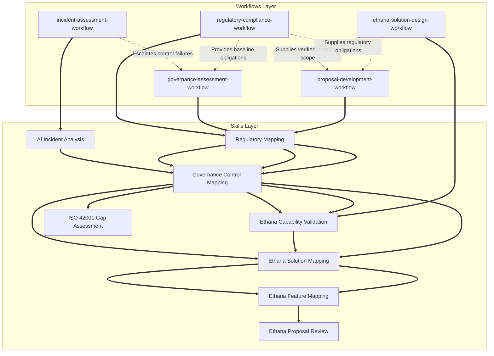

# Workflows Layer

## Overview

This directory defines the operational and executable workflows of the Governance OS. These workflows sequence Cursory's specialized skills and knowledge base files to orchestrate complex business and technical outcomes, such as incident triage, regulatory compliance scoping, and technical proposal development.

---

## 1. Workflow Dependency Graph

The following Mermaid diagram visualizes the orchestration pathways of the five core workflows and their usage of the underlying skill layer.



---

## 2. Shared Workflow Components

To maximize code reuse and reduce orchestration complexity, workflows leverage three centralized components:

### 2.1 `comp.truth_gate` (Capability Status Verification)
- **Purpose:** Verifies that any capability assertion or configuration matches the authoritative status in [canonical-product-model.md](file:///Users/ajayrajsingh/Documents/governance-os/knowledge/ethana/canonical-product-model.md).
- **Execution:** Ingests a capability string and context. Checks against the product model. If the capability is *In Build* or *Aspirational*, returns `status: ROADMAP` and triggers a mandatory fallback routing rule requiring a manual workaround.
- **Rules:** If a workflow bypasses this component when mapping features, it triggers an automatic **Claims Firewall Breach** (rejection).

### 2.2 `comp.control_architect` (Control Mapping Integrator)
- **Purpose:** Ingests high-level control recommendations or regulatory obligations and maps them to standard templates in `knowledge/controls/*`.
- **Execution:** Parses payloads from upstream skills (like `regulatory-mapping` Section 6 or `ai-incident-analysis` Section 9) and outputs draft preventive, detective, and corrective control specs.

### 2.3 `comp.raci_assigner` (Ownership Mapping)
- **Purpose:** Assigns standard organizational roles (R, A, C, I) to designed controls.
- **Execution:** Maps designed controls to standard operational roles (e.g., CISO, DPO, AI Platform Engineer) based on industry vertical sector templates (e.g., BFSI vs. General Enterprise).

---

## 3. Execution & Integration Standards

### 3.1 Input/Output Formats
All inputs and outputs between workflows must follow standardized JSON schemas:
- **Upstream Payload Passing:** Outputs must be serialized and passed via the workspace pipeline.
- **Traceability ID:** Every workflow execution must generate a unique `Traceability ID` (e.g., `TR-WF-2026-XXXX`) to link logs, evidence, and approvals.

**Available schemas in `workflows/schemas/`:**

| Schema file | Skill | Direction |
|---|---|---|
| `incident_analysis_output.json` | ai-incident-analysis | Output |
| `regulatory_mapping_output.json` | regulatory-mapping | Output |
| `control_mapping_output.json` | governance-control-mapping | Output |
| `solution_mapping_output.json` | ethana-solution-mapping | Output |
| `feature_mapping_output.json` | ethana-feature-mapping | Output |
| `proposal-review-input.schema.json` | ethana-proposal-review | Input |
| `proposal-review-output.schema.json` | ethana-proposal-review | Output |
| `iso-42001-gap-assessment-input.schema.json` | iso-42001-gap-assessment | Input |
| `iso-42001-gap-assessment-output.schema.json` | iso-42001-gap-assessment | Output |
| `ethana-capability-validation-output.schema.json` | ethana-capability-validation | Output |

The proposal-review and iso-42001-gap-assessment schemas each have explicit input and output schemas defined. The proposal-review output schema carries the machine-readable Release Audit Certificate required by the Ethana Proposal Agent before routing any document for client delivery. The iso-42001-gap-assessment output schema carries AMS, ARS, classification, and gap counts required by the Client Assessment Agent before routing any certification readiness report.

### 3.2 Error and Deviation Handling
- **Quality Gate Failure:** If a step's evaluation score falls below its pass threshold (e.g., `<85` in Control Mapping), the workflow halts and triggers the specified **Escalation Path** to the human owner.
- **Claims Firewall Breach:** Any breach of the claims firewall (e.g., listing a roadmap feature as production-ready) triggers an automatic failure, revoking the release permissions of the entire workflow.

### 3.3 Truth Gate Usage Pattern
The `comp.truth_gate` component must be executed at the transition point between control/solution mapping and technical validation:
```
[Mapping Output] ──> comp.truth_gate ──> [If Production] ──> Map to Ethana Config
                                     └──> [If In Build]   ──> Map to Roadmap + Manual Workaround
```
This pattern enforces strict commercial compliance before client proposals or technical sandbox POCs are finalized.
